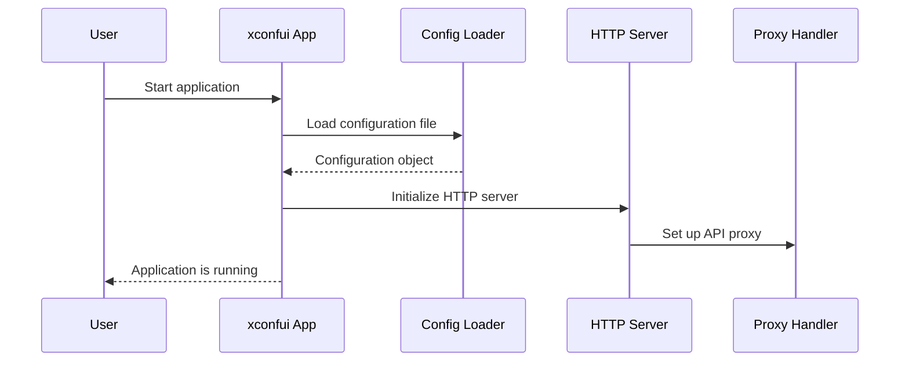

# Chapter 1: Main Application Entry Point

Welcome to the first chapter of the `xconfui` tutorial! In this chapter, we will explore the **Main Application Entry Point**—the starting point of the application. This is where the server is initialized, routing is set up, and configurations are loaded. By the end of this chapter, you will understand the foundational steps involved in getting the `xconfui` application up and running.

---

## Motivation: Why is the Entry Point Important?

The **Main Application Entry Point** serves as the foundation of the application. It ensures that critical components like configuration files, logging systems, and HTTP routing are initialized correctly. Without this starting point, the application cannot function.

For example, let’s imagine you want to start the `xconfui` application. You need:
1. A configuration file to define settings like server port and log file location.
2. A way to handle HTTP requests (routing).
3. Initialization of core utilities, such as logging and serving static files.

The entry point ties all these pieces together, ensuring the application initializes properly and is ready to serve requests.

---

## Key Concepts

Let’s break down the main concepts related to the **Main Application Entry Point**:

### 1. Configuration Initialization
The application starts by loading a configuration file to retrieve key settings such as:
- The server port.
- Paths for static resources.
- Logging file location.

### 2. HTTP Server Setup
An HTTP server is created to handle incoming requests. This includes defining routes for static files, APIs, and the application’s web interface.

### 3. Routing Initialization
Routing determines how the application responds to different HTTP requests. For instance:
- Requests to `/` load the main web interface.
- API requests are routed to backend services.

---

## How It Works: A Walkthrough

Let’s walk through the `main.go` file, which contains the entry point of the `xconfui` application.

### Loading the Configuration File
The application begins by loading its configuration file. Here’s the relevant code:

```go
configFile := flag.String("f", defaultConfigFile, "config file")
flag.Parse()

sc, err := common.NewServerConfig(*configFile)
if err != nil {
    log.Fatal(err)
}
common.SetServerConfig(sc)
```

**Explanation**:
- `flag.String` reads the configuration file path passed as a command-line argument. If no file is provided, it defaults to `defaultConfigFile`.
- `common.NewServerConfig` loads the configuration into a `ServerConfig` object.
- `common.SetServerConfig` makes the configuration globally accessible within the application.

If the configuration file is missing or invalid, the application will terminate (`log.Fatal`).

---

### Setting Up Logging
Next, the application initializes its logging system:

```go
logFile := sc.GetString("xconfadminui.log.file")
if len(logFile) > 0 {
    file, err := os.OpenFile(logFile, os.O_APPEND|os.O_CREATE|os.O_RDWR, 0666)
    if err != nil {
        panic(err)
    }
    defer file.Close()

    log.SetOutput(file)
    logging.InitLogging(sc)
} else {
    log.SetOutput(os.Stdout)
}
```

**Explanation**:
- The log file path is retrieved from the configuration (`sc.GetString`).
- If a log file path is provided, the application writes logs to that file. Otherwise, it defaults to writing logs to the console (`os.Stdout`).

---

### Defining the Web Root
The `webRoot` specifies the location of static resources (e.g., HTML, CSS, JavaScript files):

```go
webRoot = sc.GetString("xconfadminui.server.web_root")
if webRoot == "" {
    panic("server.web_root property must be set")
} else {
    webRoot = strings.TrimSuffix(webRoot, "/")
}
log.Info(fmt.Sprintf("Web server document root: %s", webRoot))
```

**Explanation**:
- The `webRoot` path is retrieved from the configuration.
- A validation check ensures `webRoot` is not empty. If it is, the application terminates with an error.

---

### Setting Up the HTTP Server and Routes
The application sets up an HTTP server and defines routes for handling requests:

```go
mux := http.NewServeMux()
mux.HandleFunc("/", Index)

backendUrlStr := sc.GetString("xconfadminui.webconfigadmin.host")
proxy := server.NewProxyToBackend(backendUrlStr)

server.RouteAdminUIApi(mux, server.ProxyRequestHandler(proxy))
server.RouteBaseApi(mux)
server.RouteStaticResources(mux, webRoot)
```

**Explanation**:
1. `http.NewServeMux` creates a multiplexer for routing requests.
2. `mux.HandleFunc("/", Index)` sets the root route (`/`) to render the web interface (`index.html`).
3. `server.NewProxyToBackend` creates a proxy to forward API requests to a backend service.
4. Additional routes are registered:
   - `server.RouteAdminUIApi` for admin-specific APIs.
   - `server.RouteBaseApi` for base application APIs.
   - `server.RouteStaticResources` for serving static files.

---

### Starting the Server
Finally, the HTTP server is started:

```go
port := sc.GetString("xconfadminui.server.port")
log.Fatal(http.ListenAndServe(port, mux))
```

**Explanation**:
- The server listens on the port specified in the configuration.
- If the server encounters an error, it logs the error and shuts down.

---

## Sequence Diagram: What Happens When the Application Starts?

To simplify the process, here’s a sequence diagram:



---

## Internal Implementation

The `main.go` file provides a clear implementation of the Main Application Entry Point. Key methods like `common.NewServerConfig`, `server.RouteAdminUIApi`, and `server.RouteStaticResources` are defined in other packages. These will be covered in later chapters.

Here’s a simplified view of the application’s startup process:
1. Load configuration using `common.NewServerConfig`.
2. Initialize logging based on configuration settings.
3. Define routes for static files and APIs.
4. Start the HTTP server to listen for incoming requests.

---

## Conclusion

In this chapter, we explored the **Main Application Entry Point**, which is the starting point of the `xconfui` application. You learned how the application initializes its configuration, sets up logging, and starts the HTTP server. This foundation ensures the application is ready to handle requests.

Next, we’ll dive deeper into [Server Configuration](02_server_configuration_.md), where we’ll explore how to define and manage the server’s settings.

---

Generated by [AI Codebase Knowledge Builder](https://github.com/The-Pocket/Tutorial-Codebase-Knowledge)