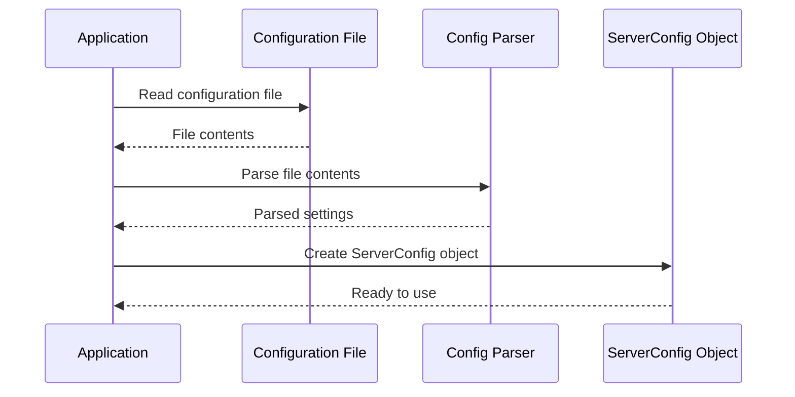

# Chapter 2: Server Configuration

In the [previous chapter](01_main_application_entry_point_.md), we introduced the **Main Application Entry Point**, which initializes the `xconfui` application and sets up the foundation for its functionality. In this chapter, we will focus on **Server Configuration**, where we manage the critical settings required to run the server effectively.

---

## Motivation: Why is Server Configuration Important?

The **Server Configuration** abstraction is responsible for loading, parsing, and managing the settings that the server depends on. These settings include details such as:

- The port number the server will use to listen for requests.
- The location of static resources (e.g., HTML, CSS, JavaScript files).
- The host address of backend services.

For example, imagine you are deploying `xconfui` in multiple environments (e.g., development, staging, and production). Each environment might have different configurations, such as:
- Development uses port `8080` and a local backend.
- Production uses port `80` and a remote backend.

By centralizing these settings into a configuration file, the **Server Configuration** abstraction allows you to load and manage these environment-specific settings easily, without modifying the code.

---

## Key Concepts

The **Server Configuration** abstraction can be broken down into the following key concepts:

### 1. Configuration File
The application reads all server settings from a configuration file. This file is written in a structured format and contains key-value pairs for different settings.

Example configuration file (`config.conf`):
```
xconfadminui.server.port = 8080
xconfadminui.server.web_root = /var/www/html
xconfadminui.webconfigadmin.host = http://localhost:9000
```

### 2. Loading Configuration
The configuration file is read and parsed at runtime. The parsed data is stored in a `ServerConfig` object, which is used to access specific settings throughout the application.

### 3. Accessing Configuration
The `ServerConfig` object provides methods to retrieve specific settings (e.g., `GetString`, `GetInt`). These methods ensure proper data types and handle missing values gracefully.

---

## How It Works: A Walkthrough

Let’s walk through the process of loading and using server configuration in the `xconfui` application.

### 1. Loading the Configuration File
The first step is to load the configuration file and parse its contents into a `ServerConfig` object. Here’s the relevant code:

```go
configFile := "config.conf"  // Path to the configuration file
sc, err := common.NewServerConfig(configFile)
if err != nil {
    log.Fatal(err)  // Exit if the configuration file cannot be loaded
}
common.SetServerConfig(sc)  // Make the configuration globally accessible
```

**Explanation**:
- The `NewServerConfig` function reads the configuration file, parses it, and creates a `ServerConfig` object.
- If the file is missing or invalid, the application logs an error and terminates.
- The `SetServerConfig` function makes the `ServerConfig` object available globally, so other parts of the application can access it.

---

### 2. Accessing Configuration Values
Once the `ServerConfig` object is created, specific settings can be retrieved using helper methods like `GetString`. Here’s an example:

```go
port := sc.GetString("xconfadminui.server.port")
webRoot := sc.GetString("xconfadminui.server.web_root")
backendHost := sc.GetString("xconfadminui.webconfigadmin.host")
```

**Explanation**:
- `GetString` retrieves the value of a setting as a string.
- In this example, `port`, `webRoot`, and `backendHost` are loaded from the configuration file.

---

### 3. Example: Using Configuration in the Server
Let’s see how the configuration values are used to set up the server:

```go
mux := http.NewServeMux()
port := sc.GetString("xconfadminui.server.port")
log.Fatal(http.ListenAndServe(port, mux))
```

**Explanation**:
- The `port` value from the configuration file determines where the server listens for incoming requests.
- The server uses `http.ListenAndServe` to start listening on the specified port.

---

## Internal Implementation

Under the hood, the **Server Configuration** abstraction is implemented in the `server/common/server_config.go` file. Let’s break down the key steps.

### Step-by-Step Walkthrough

1. **Read the Configuration File**: The file is read into memory as a byte array.
2. **Parse the Configuration**: The byte array is parsed into a structured `ServerConfig` object.
3. **Provide Access Methods**: The `ServerConfig` object provides methods like `GetString` to retrieve specific settings.

Here’s a sequence diagram to visualize this process:



---

### Code Implementation

Here’s the code for creating and managing the `ServerConfig` object:

```go
func NewServerConfig(configFile string) (*ServerConfig, error) {
    configBytes, err := ioutil.ReadFile(configFile)
    if err != nil {
        return nil, err  // Return an error if the file cannot be read
    }
    conf := configuration.ParseString(string(configBytes))
    return &ServerConfig{
        Config:      conf,
        configBytes: configBytes,
    }, nil
}

func (c *ServerConfig) GetString(key string) string {
    return c.Config.GetString(key)  // Retrieve the value of a setting as a string
}
```

**Explanation**:
- `NewServerConfig` reads the configuration file and parses its contents into a `ServerConfig` object.
- `GetString` retrieves the value of a specific setting by its key.

---

## Conclusion

In this chapter, we explored the **Server Configuration** abstraction, which handles loading, parsing, and managing server settings in the `xconfui` application. You learned how to load a configuration file, retrieve specific settings, and use them to initialize the server.

Next, we’ll dive into [Logging Configuration](03_logging_configuration_.md), where we’ll explore how to set up and manage the application’s logging system.

---

Generated by [AI Codebase Knowledge Builder](https://github.com/The-Pocket/Tutorial-Codebase-Knowledge)