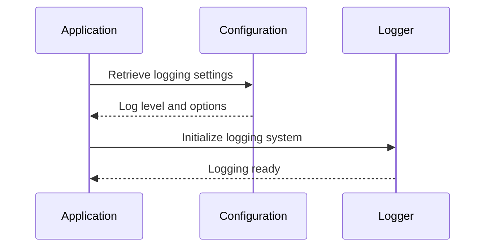

# Chapter 3: Logging Configuration

In the [previous chapter](02_server_configuration_.md), we explored **Server Configuration**, which handles the loading and management of key settings required to initialize the server. In this chapter, we will focus on **Logging Configuration**, which is responsible for initializing and managing the logging system in the `xconfui` application.

---

## Motivation: Why is Logging Configuration Important?

Logging is an essential part of any application. It helps developers and system administrators monitor the application’s behavior, troubleshoot issues, and maintain a reliable system. The **Logging Configuration** abstraction in `xconfui` ensures that logs are consistently formatted and written to the appropriate destination, such as a file or the console.

For example, consider the following use cases:
1. During development, you may want all logs to be printed to the console for real-time debugging.
2. In a production environment, you may want logs written to a file with detailed timestamps, log levels, and contextual information for later review.

The **Logging Configuration** abstraction allows the application to:
- Set log levels (e.g., `INFO`, `DEBUG`, `ERROR`) to control the verbosity of logs.
- Define log formats (e.g., JSON for structured logs).
- Configure whether logs show the source code file and line number (useful for debugging).

---

## Key Concepts

The **Logging Configuration** abstraction can be broken down into the following key concepts:

### 1. Log Levels
Log levels determine how detailed the logs should be. Common log levels include:
- `INFO`: General information about the application’s behavior.
- `DEBUG`: Detailed information for debugging purposes.
- `ERROR`: Messages indicating that something went wrong.

By configuring the log level, you can control the verbosity of logs. For example:
- In production, you might set the log level to `INFO` or `ERROR` to avoid excessive log output.
- In development, you might set the log level to `DEBUG` for maximum detail.

### 2. Log Format
The log format specifies how log messages are structured. The `xconfui` application uses a JSON format by default, making it easier to parse logs programmatically. Each log entry includes a timestamp, log level, and the log message.

### 3. Caller Reporting
Caller reporting adds information about the source file and line number where the log message was generated. This is useful for debugging, as it helps trace the origin of log messages.

---

## How It Works: A Walkthrough

Let’s walk through how the **Logging Configuration** abstraction is used in the `xconfui` application.

### 1. Initialization of Logging
The logging system is initialized during the application startup. Here’s the relevant code:

```go
func InitLogging(sc *common.ServerConfig) {
    log.SetFormatter(&log.JSONFormatter{
        TimestampFormat: common.LoggingTimeFormat,
        FieldMap: log.FieldMap{
            log.FieldKeyTime: "timestamp",
        },
    })

    logLevel := log.InfoLevel
    if parsed, err := log.ParseLevel(sc.GetString("xconfadminui.log.level")); err == nil {
        logLevel = parsed
    }
    log.SetLevel(logLevel)
    if sc.GetBoolean("xconfadminui.log.set_report_caller") {
        log.SetReportCaller(true)
    }
}
```

**Explanation**:
1. **Set Log Format**: The `JSONFormatter` is used to structure logs as JSON, with a custom timestamp format.
2. **Set Log Level**: The log level is retrieved from the configuration file (e.g., `INFO`, `DEBUG`). If the log level is invalid, it defaults to `INFO`.
3. **Enable Caller Reporting**: If the configuration option `xconfadminui.log.set_report_caller` is set to `true`, the logs will include the source file and line number.

---

### 2. Configuration File
Logging settings are defined in the configuration file. Here’s an example:

```conf
xconfadminui.log.level = debug
xconfadminui.log.set_report_caller = true
```

**Explanation**:
- `xconfadminui.log.level`: Sets the log level. In this case, it is set to `DEBUG` for detailed logging.
- `xconfadminui.log.set_report_caller`: If `true`, enables caller reporting.

---

### 3. Log Output Example
Here’s an example of how logs will appear when the above configuration is used:

```json
{
    "timestamp": "2024-01-01T12:00:00Z",
    "level": "debug",
    "msg": "Server started successfully",
    "caller": "server/main.go:42"
}
```

**Explanation**:
- `timestamp`: The time when the log was generated.
- `level`: The log level (`debug` in this case).
- `msg`: The log message.
- `caller`: The source file and line number where the log was generated.

---

### 4. Using Logging in the Application
Once the logging system is initialized, you can use it throughout the application. Here’s an example:

```go
log.Info("Starting the server...")
log.Debug("Configuration loaded successfully")
log.Error("Failed to connect to the database")
```

**Explanation**:
- `log.Info`: Logs a general informational message.
- `log.Debug`: Logs a detailed debugging message.
- `log.Error`: Logs an error message.

The output of these logs will depend on the configured log level. For example, if the log level is set to `INFO`, only `INFO` and higher-level messages (`ERROR`) will be logged.

---

## Internal Implementation

Let’s dive into the internal implementation of the **Logging Configuration** abstraction.

### Step-by-Step Walkthrough
Here’s what happens when the logging system is initialized:

1. **Read Configuration**: The log level and other settings are retrieved from the configuration file.
2. **Set Log Format**: The log format is set to JSON with a custom timestamp format.
3. **Set Log Level**: The log level is parsed and applied. If the log level is invalid, it defaults to `INFO`.
4. **Enable Caller Reporting**: If enabled, the logging system includes the source file and line number in log messages.

Here’s a sequence diagram to illustrate this process:



### Code Implementation
The logging system is implemented in the `server/logging/logconfig.go` file. Here’s the code:

```go
func InitLogging(sc *common.ServerConfig) {
    log.SetFormatter(&log.JSONFormatter{
        TimestampFormat: common.LoggingTimeFormat,
        FieldMap: log.FieldMap{
            log.FieldKeyTime: "timestamp",
        },
    })

    logLevel := log.InfoLevel
    if parsed, err := log.ParseLevel(sc.GetString("xconfadminui.log.level")); err == nil {
        logLevel = parsed
    }
    log.SetLevel(logLevel)
    if sc.GetBoolean("xconfadminui.log.set_report_caller") {
        log.SetReportCaller(true)
    }
}
```

**Explanation**:
- `log.SetFormatter`: Sets the log format to JSON with custom fields.
- `log.ParseLevel`: Parses the log level from the configuration.
- `log.SetLevel`: Sets the log level for the application.
- `log.SetReportCaller`: Enables caller reporting if configured.

---

## Conclusion

In this chapter, we explored the **Logging Configuration** abstraction, which initializes and configures the logging system in the `xconfui` application. You learned how to:
- Set up logging with configurable log levels, formats, and caller reporting.
- Use the logging system to output messages in a structured JSON format.
- Customize logging behavior through configuration settings.

Next, we’ll dive into [HTTP Routing and Handlers](04_http_routing_and_handlers_.md), where we’ll explore how the application handles incoming HTTP requests and routes them appropriately.

---

Generated by [AI Codebase Knowledge Builder](https://github.com/The-Pocket/Tutorial-Codebase-Knowledge)