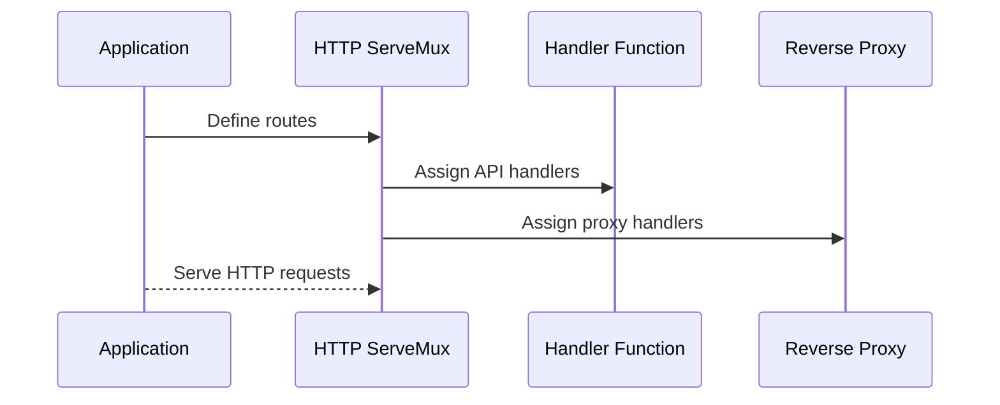

# Chapter 4: HTTP Routing and Handlers

In the [previous chapter](03_logging_configuration_.md), we explored **Logging Configuration**, which ensures that the application outputs structured and meaningful logs for monitoring and debugging. In this chapter, we will focus on **HTTP Routing and Handlers**, which defines how the application processes incoming HTTP requests and routes them to specific handlers for processing.

---

## Motivation: Why is HTTP Routing Important?

HTTP Routing is a critical component of web applications. It determines how incoming HTTP requests are processed based on their URL paths and methods (e.g., `GET`, `POST`). For example, when a user visits the URL `/healthz`, the application should respond with its health status, while a request to `/app/index.html` should serve a static HTML file.

In the `xconfui` project, routing is used to achieve two primary goals:
1. **API Endpoint Handling**: Direct HTTP requests to the correct API handlers for dynamic data processing.
2. **Static Resource Serving**: Serve static resources like HTML, CSS, JavaScript, and images.

By defining clear routes and assigning appropriate handlers, the application ensures that user requests are processed efficiently and correctly.

---

## Key Concepts

To better understand HTTP Routing and Handlers in `xconfui`, let’s break it down into the following key concepts:

### 1. Routing
Routing determines how incoming HTTP requests are matched to specific handlers based on their URL path. For example:
- Requests to `/monitor` are handled by the `MonitorHandler`.
- Requests to `/app/` are routed to serve static files from the `app` directory.

### 2. Handlers
Handlers are functions responsible for processing HTTP requests and generating responses. A handler can:
- Return JSON data for API endpoints.
- Perform logic and interact with backend services.
- Serve static files for the web interface.

### 3. Proxy Requests
Some API requests are forwarded to a backend service using the reverse proxy mechanism. This allows the application to act as an intermediary between the user and the backend.

---

## How It Works: A Walkthrough

### 1. Defining Routes
Routes are defined using the `http.ServeMux` multiplexer. Each route specifies a URL path and assigns a handler function to process requests for that path.

Example: Defining routes for basic API endpoints:
```go
mux := http.NewServeMux()
mux.HandleFunc("/monitor", MonitorHandler)
mux.HandleFunc("/healthz", HealthZHandler)
mux.HandleFunc("/version", VersionHandler)
```

**Explanation**:
- `http.NewServeMux` creates a multiplexer to manage routes.
- `mux.HandleFunc` maps a URL path (e.g., `/monitor`) to a handler function (`MonitorHandler`).
- When a request matches the URL path, the corresponding handler is executed.

---

### 2. Handling API Requests
Handlers are functions that process HTTP requests and generate responses. For example, the `HealthZHandler` checks the health of the application and responds with an HTTP 200 status code.

Example: Simple `HealthZHandler` implementation:
```go
func HealthZHandler(w http.ResponseWriter, r *http.Request) {
    w.WriteHeader(http.StatusOK)
    w.Write([]byte("OK"))
}
```

**Explanation**:
- `w.WriteHeader(http.StatusOK)` sets the HTTP status code to 200 (OK).
- `w.Write([]byte("OK"))` writes a plain text response to the client.

---

### 3. Serving Static Resources
Static resources like HTML and images are served using the `http.FileServer`. The application defines routes for directories containing these files.

Example: Defining routes for static resources:
```go
fsApp := http.FileServer(http.Dir("/path/to/app"))
mux.Handle("/app/", http.StripPrefix("/app/", fsApp))
```

**Explanation**:
- `http.FileServer` serves files from the specified directory (`/path/to/app`).
- `http.StripPrefix("/app/", fsApp)` ensures that requests to `/app/` are correctly mapped to the directory.

---

### 4. Proxying Requests to the Backend
Some API requests are forwarded to a backend service using a reverse proxy. The application creates a proxy instance and assigns a handler to process these requests.

Example: Proxying requests to a backend:
```go
proxy := NewProxyToBackend("http://backend-service")
mux.HandleFunc("/provider", ProxyRequestHandler(proxy))
```

**Explanation**:
- `NewProxyToBackend` creates a reverse proxy to the backend service (`http://backend-service`).
- `ProxyRequestHandler(proxy)` processes incoming requests and forwards them to the backend.

---

## Internal Implementation

Let’s explore what happens internally when the application sets up HTTP Routing and Handlers.

### Step-by-Step Walkthrough
Here’s a simplified sequence of what happens when the application initializes routing:



**Explanation**:
1. The application defines routes using the HTTP multiplexer (`ServeMux`).
2. Routes are mapped to handler functions for processing API requests or static resources.
3. Proxy handlers are created for forwarding specific requests to backend services.

---

### Code Implementation

#### Route Definitions
Routes are defined in the `server/router.go` file. Here’s an example:

```go
func RouteBaseApi(mux *http.ServeMux) {
    mux.HandleFunc("/monitor", MonitorHandler)
    mux.HandleFunc("/healthz", HealthZHandler)
    mux.HandleFunc("/version", VersionHandler)
}
```

**Explanation**:
- `RouteBaseApi` defines routes for basic API endpoints.
- Each route maps a URL path to its corresponding handler.

---

#### Proxy Setup
The reverse proxy is implemented using the `httputil.ReverseProxy` package. Here’s the code for creating a proxy:

```go
func NewProxyToBackend(targetHost string) *httputil.ReverseProxy {
    url, err := url.Parse(targetHost)
    if err != nil {
        panic(err)
    }
    return httputil.NewSingleHostReverseProxy(url)
}
```

**Explanation**:
- `url.Parse(targetHost)` parses the backend URL.
- `httputil.NewSingleHostReverseProxy(url)` creates a reverse proxy instance.

---

#### Static Resource Handling
Static resources are served using the `http.FileServer`. Here’s the code:

```go
func RouteStaticResources(mux *http.ServeMux, webRoot string) {
    fsApp := http.FileServer(http.Dir(fmt.Sprintf("%s/app", webRoot)))
    mux.Handle("/app/", http.StripPrefix("/app/", fsApp))
}
```

**Explanation**:
- `http.FileServer` serves files from the `/app` directory.
- `http.StripPrefix` maps requests to `/app/` to the correct directory structure.

---

## Conclusion

In this chapter, we explored how **HTTP Routing and Handlers** are used to process incoming HTTP requests and route them to appropriate handlers. You learned how to:
- Define routes for API endpoints and static resources.
- Implement handlers to process requests and generate responses.
- Set up a reverse proxy for forwarding requests to backend services.

Next, we’ll dive into [Reverse Proxy Configuration](05_reverse_proxy_configuration_.md), where we’ll explore how to configure and manage reverse proxy behavior in detail.

---

Generated by [AI Codebase Knowledge Builder](https://github.com/The-Pocket/Tutorial-Codebase-Knowledge)