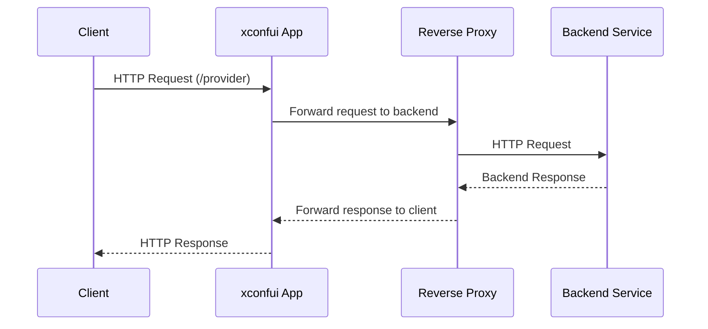

# Chapter 5: Reverse Proxy Configuration

In the [previous chapter](04_http_routing_and_handlers_.md), we explored **HTTP Routing and Handlers**, which showed how the application processes incoming HTTP requests and routes them to appropriate handlers. In this chapter, we will focus on **Reverse Proxy Configuration**, an essential capability that allows the application to forward specific requests to backend services. 

---

## Motivation: Why is Reverse Proxy Configuration Important?

Modern applications often need to interact with multiple backend services to provide functionality. A reverse proxy acts as an intermediary between the client and backend services, forwarding client requests as needed. This configuration enables the application to:

1. Hide the complexity of backend services from clients.
2. Add a layer of abstraction, allowing flexibility in changing or scaling backend services without affecting the client.
3. Centralize the management of request forwarding, reducing duplication and improving maintainability.

For example, consider a use case where the `xconfui` application needs to interact with a backend service to retrieve firmware configurations. Instead of exposing the backend service URL directly to the client, the reverse proxy intercepts requests to a specific route (e.g., `/provider`) and forwards them to the backend service (e.g., `http://backend-service`). This ensures a clean separation between frontend and backend while maintaining security and scalability.

---

## Key Concepts

To understand how reverse proxy configuration works in the `xconfui` application, we can break it down into the following key concepts:

### 1. Proxy Creation
A reverse proxy is created to forward requests to a specific backend service. This involves:
- Specifying the backend service URL.
- Configuring the proxy to handle HTTP requests.

### 2. Proxy Request Handling
The reverse proxy is assigned to handle specific routes. When a request matches one of these routes, the proxy forwards the request to the backend, adds necessary headers, and sends the backend's response back to the client.

### 3. Route Integration
The reverse proxy is integrated into the application's routing system, ensuring that only designated routes are proxied while others are handled by the application itself.

---

## How It Works: A Walkthrough

### 1. Creating a Reverse Proxy

The first step in reverse proxy configuration is to create the proxy instance. This is done using the `httputil.ReverseProxy` package in Go.

```go
func NewProxyToBackend(targetHost string) *httputil.ReverseProxy {
    url, err := url.Parse(targetHost)
    if err != nil {
        panic(err)
    }
    return httputil.NewSingleHostReverseProxy(url)
}
```

**Explanation**:
- `targetHost`: The URL of the backend service (e.g., `http://backend-service`).
- `url.Parse`: Parses the backend service URL and ensures it is valid.
- `httputil.NewSingleHostReverseProxy`: Creates a reverse proxy instance configured to forward requests to the specified URL.

If the `targetHost` is invalid, the application will terminate.

**Example Input**:
```go
proxy := NewProxyToBackend("http://backend-service")
```

**Result**:
A reverse proxy instance is created, ready to forward requests to `http://backend-service`.

---

### 2. Handling Requests with the Proxy

Once the reverse proxy is created, it needs to handle incoming HTTP requests. This is done by wrapping the proxy in a handler function.

```go
func ProxyRequestHandler(proxy *httputil.ReverseProxy) func(http.ResponseWriter, *http.Request) {
    return func(w http.ResponseWriter, r *http.Request) {
        r.Header.Set("X-Request-ID", "adminui")
        proxy.ServeHTTP(w, r)
    }
}
```

**Explanation**:
- `r.Header.Set`: Adds a custom header (`X-Request-ID`) to the request before forwarding it to the backend. This header can be used for tracking or identification purposes.
- `proxy.ServeHTTP`: Forwards the incoming request (`r`) to the backend service and writes the backend's response to the client (`w`).

**Example Usage**:
```go
mux.HandleFunc("/provider", ProxyRequestHandler(proxy))
```

**Result**:
Requests to the `/provider` route are intercepted and forwarded to the backend service by the proxy.

---

### 3. Integrating the Proxy into Routes

The final step is to integrate the proxy into the application's routing system. This ensures that specific routes are handled by the proxy while others are processed by regular handlers.

```go
func RouteAdminUIApi(mux *http.ServeMux, ProxyRequestHandler func(http.ResponseWriter, *http.Request)) {
    mux.HandleFunc("/provider", ProxyRequestHandler)
    // Additional routes can be added here
}
```

**Explanation**:
- `mux.HandleFunc`: Maps the `/provider` route to the `ProxyRequestHandler`, ensuring that requests to this route are forwarded to the backend.

---

## Internal Implementation

Let’s explore what happens under the hood when a request is proxied in the `xconfui` application.

### Step-by-Step Walkthrough

Here’s the process visualized in a sequence diagram:



**Explanation**:
1. The client sends an HTTP request to the application (e.g., `/provider`).
2. The application identifies the route and forwards the request to the reverse proxy.
3. The proxy sends the request to the configured backend service.
4. The backend processes the request and returns a response.
5. The proxy forwards the backend's response back to the client.

---

### Code Implementation

#### Proxy Creation
The reverse proxy is created in the `server/router.go` file. Here’s the code:

```go
func NewProxyToBackend(targetHost string) *httputil.ReverseProxy {
    url, err := url.Parse(targetHost)
    if err != nil {
        panic(err)
    }
    return httputil.NewSingleHostReverseProxy(url)
}
```

**Explanation**:
- This function initializes a reverse proxy for the specified backend service.

---

#### Proxy Request Handling
The proxy request handler is implemented in the same file:

```go
func ProxyRequestHandler(proxy *httputil.ReverseProxy) func(http.ResponseWriter, *http.Request) {
    return func(w http.ResponseWriter, r *http.Request) {
        r.Header.Set("X-Request-ID", "adminui")
        proxy.ServeHTTP(w, r)
    }
}
```

**Explanation**:
- The handler wraps the proxy to add custom headers and forward requests.

---

#### Route Integration
The proxy is integrated into the routing system like this:

```go
func RouteAdminUIApi(mux *http.ServeMux, ProxyRequestHandler func(http.ResponseWriter, *http.Request)) {
    mux.HandleFunc("/provider", ProxyRequestHandler)
}
```

**Explanation**:
- This function maps the `/provider` route to the proxy handler.

---

## Conclusion

In this chapter, we explored **Reverse Proxy Configuration**, which enables the `xconfui` application to forward requests to backend services. You learned how to:
- Create a reverse proxy to handle backend requests.
- Use a proxy request handler to wrap the proxy with additional headers.
- Integrate the proxy into the application's routing system.

By understanding this configuration, you can extend the application to interact with multiple backend services seamlessly.

In the next chapter, we will explore the [Changelog Feature](06_changelog_feature_.md), which provides insights into the application's change history.

---

Generated by [AI Codebase Knowledge Builder](https://github.com/The-Pocket/Tutorial-Codebase-Knowledge)