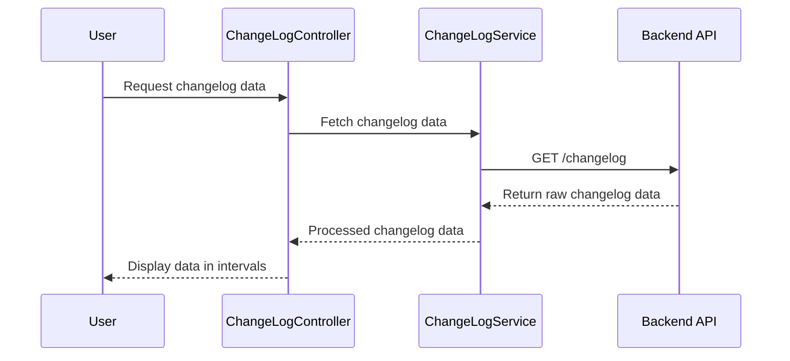

# Chapter 6: Changelog Feature

In the [previous chapter](05_reverse_proxy_configuration_.md), we explored **Reverse Proxy Configuration**, which allows the application to forward client requests to backend services seamlessly. In this chapter, we will focus on the **Changelog Feature**, a critical functionality for tracking and displaying changes in the application.

---

## Motivation: Why is the Changelog Feature Important?

The **Changelog Feature** serves as a central point for monitoring and analyzing changes made within the system over time. It is essential for maintaining transparency, debugging, and understanding the history of operations performed in the application. 

For example, consider a scenario where you need to investigate changes in configuration settings over the last 24 hours. The changelog provides a detailed history of operations—such as `CREATE` and `DELETE`—along with timestamps, making it easier to track who did what and when.

This feature is implemented using controllers, modules, and services to:
1. Retrieve changelog data from the backend.
2. Process and organize this data into meaningful intervals.
3. Display these changes to the user in a structured and intuitive way.

---

## Key Concepts

The **Changelog Feature** is built using three main components: **Controller**, **Module**, and **Service**. Let’s break these down.

### 1. Controller: Managing the View Logic
The **Controller** is responsible for:
- Fetching changelog data from the backend.
- Organizing the data into time intervals.
- Handling any intermediate processing needed for the view.

### 2. Module: Organizing the Feature
The **Module** acts as a container for all components (e.g., controller and service) related to the changelog feature. It ensures they are properly registered and can work together.

### 3. Service: Fetching and Processing Data
The **Service** is responsible for:
- Retrieving raw changelog data from the backend API.
- Counting and categorizing operations (e.g., `CREATE` and `DELETE`) for each time interval.
- Providing processed data to the controller.

---

## How It Works: A Walkthrough

Let’s explore how the **Changelog Feature** works step-by-step.

### 1. Fetching Changelog Data

The `ChangeLogService` fetches raw changelog data from the backend API. It uses AngularJS's `$http` service to make a `GET` request to the API endpoint.

Example code for fetching data:
```javascript
function getChangeLog() {
    return $http.get('changelog');
}
```

**Explanation**:
- The `getChangeLog` function sends a `GET` request to the `changelog` endpoint.
- The server returns a JSON object containing the changelog data.

---

### 2. Organizing Data into Time Intervals

The `ChangeLogController` processes the raw changelog data to group it into intervals. Each interval contains:
- A start and end time.
- A list of changes within that interval.
- A count of `CREATE` and `DELETE` operations.

Example code for processing data:
```javascript
function fillIntervalsList(data) {
    var sortedTimestamps = getSortedKeys(data);
    for (var i = 0; i < sortedTimestamps.length; i++) {
        var changesObj = {};
        changesObj.startOfInterval = timeFromTimestamp(sortedTimestamps[i]);
        changesObj.endOfInterval = timeFromTimestamp(sortedTimestamps[i + 1] - 1000 || Date.now());
        changesObj.changesList = data[sortedTimestamps[i]];
        changeLogService.countAndSaveOperationsNumber(data[sortedTimestamps[i]], changesObj);
        vm.intervalsList.push(changesObj);
    }
}
```

**Explanation**:
- `getSortedKeys`: Retrieves and sorts the timestamps from the changelog data.
- For each timestamp:
  - The start and end times of the interval are calculated.
  - The list of changes for that interval is extracted.
  - The number of `CREATE` and `DELETE` operations is counted.
- The interval is stored in `vm.intervalsList` for display.

---

### 3. Displaying Changelog Data

Once the data is processed, it is displayed to the user. The controller exposes the `intervalsList` to the view, which can then render it using AngularJS directives (e.g., `ng-repeat`).

---

## Internal Implementation

Let’s look at how the **Changelog Feature** is implemented internally.

### Step-by-Step Walkthrough

Here’s a simplified sequence diagram to illustrate the process:



**Explanation**:
1. The user requests the changelog data (e.g., by visiting the changelog page).
2. The controller calls the service to fetch data.
3. The service sends an API request to the backend and retrieves raw data.
4. The service processes the data and returns it to the controller.
5. The controller organizes the data into intervals and displays it to the user.

---

### Code Implementation

#### Controller
The controller is implemented in `changelog.controller.js`:
```javascript
function controller($log, changeLogService) {
    var vm = this;
    vm.intervalsList = [];
    vm.isDataLoading = false;

    init();

    function init() {
        vm.isDataLoading = true;
        changeLogService.getChangeLog().then(
            function(result) {
                fillIntervalsList(result.data);
            },
            function(reason) {
                $log.debug('REASON', reason);
            }
        ).finally(function() {
            vm.isDataLoading = false;
        });
    }
}
```

**Explanation**:
- The `init` function fetches the changelog data and processes it.
- The `fillIntervalsList` function organizes data into intervals.

---

#### Module
The module is implemented in `changelog.module.js`:
```javascript
angular.module('app.changeLog', ['app.filters']);
```

**Explanation**:
- The `app.changeLog` module is defined and depends on `app.filters`.

---

#### Service
The service is implemented in `changelog.service.js`:
```javascript
function service($http) {
    var API_URL = 'changelog';

    return {
        getChangeLog: getChangeLog,
        countAndSaveOperationsNumber: countAndSaveOperationsNumber
    };

    function getChangeLog() {
        return $http.get(API_URL);
    }
}
```

**Explanation**:
- The `getChangeLog` function retrieves raw data from the backend.
- The `countAndSaveOperationsNumber` function counts `CREATE` and `DELETE` operations for each interval.

---

## Conclusion

In this chapter, we explored the **Changelog Feature**, which tracks and displays changes in the application. You learned how to:
- Fetch changelog data from the backend.
- Organize the data into meaningful intervals.
- Display the data to the user in a structured format.

In the [next chapter](07_core_utility_services_.md), we will explore **Core Utility Services**, which provide essential functionality for the application.

---

Generated by [AI Codebase Knowledge Builder](https://github.com/The-Pocket/Tutorial-Codebase-Knowledge)