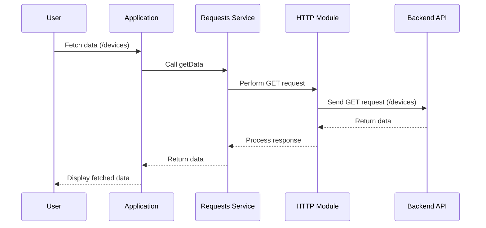

# Chapter 7: Core Utility Services

In the [previous chapter](06_changelog_feature_.md), we explored the **Changelog Feature**, which tracks and displays changes in the application. Now, we turn our attention to **Core Utility Services**, a foundational abstraction that provides general-purpose utility services used throughout the application. These services are critical for ensuring consistency, modularity, and code reuse across various features.

---

## Motivation: Why Are Core Utility Services Important?

Applications often need common functionality that is used repeatedly across multiple modules, features, or components. Instead of duplicating this functionality in each part of the application, **Core Utility Services** centralize it, ensuring that these tasks are handled consistently and efficiently.

For example, consider the following use cases:
1. **Error Handling**: Displaying user-friendly error messages when an operation fails.
2. **Data Validation**: Checking whether inputs meet expected criteria (e.g., non-empty strings, valid numbers).
3. **Array Manipulation**: Removing duplicates or filtering out invalid entries from arrays.
4. **Request Handling**: Performing HTTP operations like `GET`, `POST`, `DELETE`, and `PUT`.

With **Core Utility Services**, developers can easily access these reusable utilities without rewriting or overcomplicating their code. This approach improves maintainability, reduces errors, and accelerates development.

---

## Key Concepts

The **Core Utility Services** abstraction is divided into three main components:
1. **Alerts Service**: Handles user notifications such as success, warning, and error messages.
2. **Requests Service**: Manages HTTP operations, including fetching data, saving updates, and deleting items.
3. **Utils Service**: Provides general-purpose utilities such as validation, array operations, and data transformations.

Let’s explore each of these components in detail.

---

### 1. Alerts Service

The **Alerts Service** provides methods to display user-facing messages for success, error, and warning events. It ensures that notifications are consistently formatted and displayed across the application.

#### Example Use Case
Imagine a scenario where a user tries to save a configuration but encounters a validation error. The **Alerts Service** can display a clear error message, helping the user understand what went wrong.

#### Key Methods
- `successfullySaved(entity)`: Displays a success message when an entity is saved.
- `failedToLoadData(entity, reason)`: Displays an error message when data fails to load.
- `showWarningMessage(obj)`: Displays a warning message for specific conditions.

#### Example Code
```javascript
alertsService.successfullySaved('Configuration');
alertsService.failedToLoadData('Device Settings', 'Network error');
alertsService.showWarningMessage({ message: 'Please make changes before saving.', title: 'Warning' });
```

**Explanation**:
- `successfullySaved`: Displays a success notification for the saved configuration.
- `failedToLoadData`: Displays an error notification if the application fails to load device settings due to a network issue.
- `showWarningMessage`: Displays a warning, encouraging the user to modify settings before saving.

---

### 2. Requests Service

The **Requests Service** manages HTTP operations such as `GET`, `POST`, `PUT`, and `DELETE`. It simplifies data fetching, updating, and deletion by providing reusable methods.

#### Example Use Case
Suppose the application needs to fetch a list of devices from an API endpoint. The **Requests Service** provides a streamlined way to perform this HTTP `GET` request.

#### Key Methods
- `getData(url, headers, params)`: Fetches data from the specified URL.
- `postData(url, data, headers)`: Sends data to the server using an HTTP `POST` request.
- `deleteItem(url, headers, optData)`: Deletes an item using an HTTP `DELETE` request.

#### Example Code
```javascript
requestsService.getData('/devices', { Authorization: 'Bearer token' }, { type: 'active' }).then(
    function(data) {
        console.log('Fetched devices:', data);
    },
    function(error) {
        console.error('Failed to fetch devices:', error);
    }
);
```

**Explanation**:
- `getData`: Sends an HTTP `GET` request to fetch active devices from the `/devices` endpoint.
- `then`: Handles the promise, logging the fetched data or any encountered errors.

---

### 3. Utils Service

The **Utils Service** provides general-purpose utilities for tasks like validation, array manipulation, and data transformations.

#### Example Use Case
Imagine a scenario where you need to filter out invalid entries from a list of user inputs. The **Utils Service** provides methods to check for null, undefined, or empty values.

#### Key Methods
- `isEmptyString(stringToTest)`: Checks if a string is empty or contains only whitespace.
- `arrayHasDuplicates(array)`: Determines whether an array contains duplicate values.
- `convertObjectToArray(obj)`: Converts an object into an array of key-value pairs.

#### Example Code
```javascript
var inputs = ['value1', '', 'value2'];
var isValid = !utilsService.isEmptyString(inputs[1]);
var hasDuplicates = utilsService.arrayHasDuplicates(['a', 'b', 'a']);
var array = utilsService.convertObjectToArray({ key1: 'value1', key2: 'value2' });
```

**Explanation**:
- `isEmptyString`: Checks if the second input in the `inputs` array is valid (non-empty).
- `arrayHasDuplicates`: Identifies duplicates in the array `['a', 'b', 'a']`.
- `convertObjectToArray`: Converts the object `{ key1: 'value1', key2: 'value2' }` into an array of key-value pairs.

---

## Internal Implementation

Let’s explore what happens under the hood when one of these services is called.

### Step-by-Step Walkthrough

Here’s a sequence diagram for how the **Requests Service** handles a `GET` request:



**Explanation**:
1. The user initiates a request to fetch device data.
2. The application calls the `getData` method in the **Requests Service**.
3. The **Requests Service** uses the HTTP module to send a `GET` request to the backend.
4. The backend responds with the requested data.
5. The **Requests Service** processes the response and returns the data to the application.
6. The application displays the data to the user.

---

### Code Implementation

#### Alerts Service
Located in `app/shared/core/alerts.service.js`. Example method:
```javascript
function failedToLoadData(entity, reason) {
    var errorMsg = 'Failed to load ' + entity;
    if (!utils.isEmptyString(reason)) {
        errorMsg += ' ' + reason;
    }
    toastr.error(errorMsg, 'Error', { closeButton: true, timeOut: 10000 });
}
```

**Explanation**:
- Builds an error message using the entity name and reason.
- Displays the message using `toastr.error`.

---

#### Requests Service
Located in `app/shared/core/requests-service.js`. Example method:
```javascript
function getData(url, headers, params) {
    return $http({
        method: 'GET',
        url: url,
        headers: headers,
        params: params
    }).then(function(response) {
        return response.data;
    }, function(error) {
        return $q.reject(error);
    });
}
```

**Explanation**:
- Sends an HTTP `GET` request with the provided URL, headers, and parameters.
- Returns the response data or rejects the promise if an error occurs.

---

#### Utils Service
Located in `app/shared/services/utils.service.js`. Example method:
```javascript
function isEmptyString(stringToTest) {
    return !stringToTest || stringToTest.trim().length === 0;
}
```

**Explanation**:
- Checks if the string is null, undefined, or contains only whitespace.

---

## Conclusion

In this chapter, we explored **Core Utility Services**, which provide reusable functionality across the application. You learned how:
- The **Alerts Service** handles user notifications for success, warning, and error events.
- The **Requests Service** manages HTTP operations like data fetching and updates.
- The **Utils Service** provides general-purpose utilities for validation and data manipulation.

These services form the backbone of the application, enabling modular and consistent development.

In the [next chapter](08_directive_features_.md), we will explore **Directive Features**, which enhance the application with reusable UI components.

---

Generated by [AI Codebase Knowledge Builder](https://github.com/The-Pocket/Tutorial-Codebase-Knowledge)