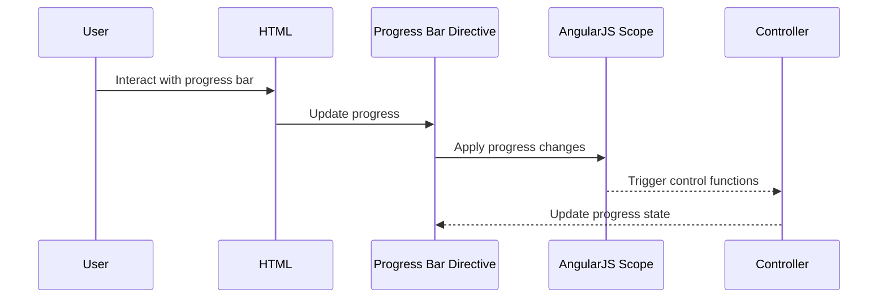

# Chapter 8: Directive Features

In the [previous chapter](07_core_utility_services_.md), we explored **Core Utility Services**, which provide foundational utilities for HTTP operations, alerts, and general-purpose functionality. In this chapter, we will focus on **Directive Features**, a key abstraction for creating reusable, modular, and interactive UI components in the `xconfui` application.

---

## Motivation: Why Are Directive Features Important?

Modern web applications often rely on dynamic and interactive user interfaces (UI) to enhance user experience. However, creating and maintaining complex UI components can lead to code duplication, inconsistencies, and difficulties in managing the codebase. **Directive Features** address these challenges by enabling developers to define reusable, encapsulated UI elements using AngularJS directives.

For example, consider a scenario where you need a progress bar to display the status of a file upload. Instead of implementing the same progress bar logic and design multiple times, you can use a directive to create a single, reusable component. This approach simplifies the codebase, ensures consistency, and makes it easier to update or modify the progress bar in the future.

In the `xconfui` project, **Directive Features** are used to implement UI components like:
1. **Progress Bars**: Display progress for an ongoing task.
2. **Dropdown Multi-Selects**: Allow users to select multiple options from a dropdown menu.

By using directives, these components are:
- Encapsulated: Each directive contains its own logic, template, and styling.
- Reusable: The same directive can be used in multiple places with different configurations.
- Maintainable: Changes to the directive automatically propagate to all instances.

---

## Key Concepts

The **Directive Features** abstraction in `xconfui` is built around two primary directives:
1. **Custom Progress Bar Directive**: A reusable component for displaying progress.
2. **Dropdown Multiselect Directive**: A customizable dropdown for selecting multiple options.

Let’s explore each directive in detail.

---

### 1. Custom Progress Bar Directive

The **Custom Progress Bar Directive** provides a way to visually represent the progress of a task. It is designed to be flexible and easy to integrate into different parts of the application.

#### Example Use Case
Imagine a scenario where a user uploads a firmware file. The progress bar updates dynamically as the file upload progresses, providing real-time feedback to the user.

#### How to Use the Directive
To use the progress bar directive, include it in your HTML and bind it to a control object that manages its behavior.

Example HTML:
```html
<custom-progressbar control="progressBarControl"></custom-progressbar>
```

**Explanation**:
- `<custom-progressbar>`: The custom directive for the progress bar.
- `control="progressBarControl"`: Binds the directive to a control object (`progressBarControl`) in the AngularJS controller.

In your controller, you can define and update the `progressBarControl` object to manage the progress bar's behavior:

Example Controller Code:
```javascript
$scope.progressBarControl = {
    total: 100,
    progress: function(value) {
        console.log('Progress updated:', value);
    },
    next: function() {
        console.log('Next step triggered');
    }
};
```

**Explanation**:
- `total`: The total value for the progress bar (e.g., 100%).
- `progress`: A function to update the progress bar.
- `next`: A function triggered when progress is updated.

---

### 2. Dropdown Multiselect Directive

The **Dropdown Multiselect Directive** provides a dropdown menu that allows users to select multiple options. It is fully customizable and supports features like "Select All" and "Deselect All."

#### Example Use Case
Consider a scenario where a user needs to assign multiple configurations to a device. The dropdown multiselect lets the user select multiple options from a list of configurations.

#### How to Use the Directive
To use the dropdown multiselect directive, include it in your HTML and bind it to the required properties.

Example HTML:
```html
<dropdown-multiselect 
    model="selectedOptions" 
    options="availableOptions" 
    label-property="name" 
    value-property="id" 
    button-text="Select Configurations">
</dropdown-multiselect>
```

**Explanation**:
- `model="selectedOptions"`: Binds the directive to the `selectedOptions` array, which stores the selected values.
- `options="availableOptions"`: Binds the directive to the `availableOptions` array, which contains the list of options.
- `label-property="name"`: Specifies the property used to display the option label.
- `value-property="id"`: Specifies the property used as the option value.
- `button-text="Select Configurations"`: Sets the text displayed on the dropdown button.

In your controller, define the `selectedOptions` and `availableOptions` arrays:

Example Controller Code:
```javascript
$scope.availableOptions = [
    { id: 1, name: 'Configuration A' },
    { id: 2, name: 'Configuration B' },
    { id: 3, name: 'Configuration C' }
];
$scope.selectedOptions = [];
```

**Explanation**:
- `availableOptions`: The list of available configurations.
- `selectedOptions`: Initially empty, this array will be populated with the selected options.

---

## Internal Implementation

Let’s explore how these directives work internally.

### Step-by-Step Walkthrough

Here’s a sequence diagram for the progress bar directive:



**Explanation**:
1. The user interacts with the progress bar (e.g., by starting a task).
2. The directive updates the progress bar based on the `control` object.
3. The `control` object triggers functions in the controller to manage the progress state.

---

### Code Implementation

#### Custom Progress Bar Directive
The directive is implemented in `custom-progressbar.directive.js`:

```javascript
function directive($timeout) {
    function linkFunction(scope, element, attrs) {
        scope.data = { progress: 0 };

        scope.internalControl = scope.control || {};
        scope.internalControl.progress = function(progress) {
            scope.data.progress += Math.round(progress * 100 / scope.internalControl.total);
        };
    }

    return {
        restrict: 'E',
        scope: { control: '=control' },
        link: linkFunction,
        templateUrl: 'custom-progressbar.directive.html'
    };
}
```

**Explanation**:
- `scope.data.progress`: Tracks the current progress value.
- `scope.internalControl.progress`: Updates the progress bar.

---

#### Dropdown Multiselect Directive
The directive is implemented in `dropdown-multiselect.directive.js`:

```javascript
function directive() {
    return {
        restrict: 'E',
        scope: {
            model: '=',
            options: '=',
            labelProperty: '@',
            valueProperty: '@',
            buttonText: '@'
        },
        templateUrl: 'dropdown-multiselect.directive.html',
        link: function($scope) {
            $scope.selectAll = function() {
                $scope.model = _.pluck($scope.options, $scope.valueProperty);
            };

            $scope.deselectAll = function() {
                $scope.model = [];
            };
        }
    };
}
```

**Explanation**:
- `selectAll`: Selects all options.
- `deselectAll`: Clears all selected options.

---

## Conclusion

In this chapter, we explored **Directive Features**, which enable the creation of reusable UI components in the `xconfui` application. You learned how to:
- Use the **Custom Progress Bar Directive** to display task progress.
- Use the **Dropdown Multiselect Directive** to allow multi-selection in dropdowns.
- Understand the internal implementation of these directives.

In the [next chapter](09_firmware_management_.md), we will dive into **Firmware Management**, a feature for managing firmware files and configurations.

---

Generated by [AI Codebase Knowledge Builder](https://github.com/The-Pocket/Tutorial-Codebase-Knowledge)