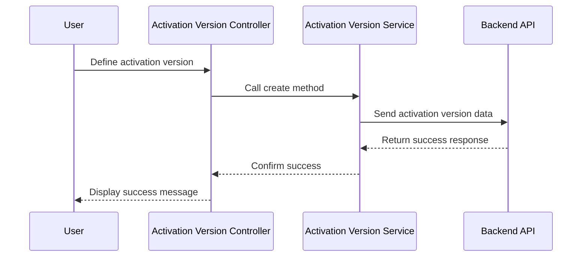

# Chapter 9: Firmware Management

In the [previous chapter](08_directive_features_.md), we explored **Directive Features**, which enable the creation of reusable, modular UI components. In this chapter, we will focus on **Firmware Management**, a critical feature that allows the application to manage firmware files, activation versions, firmware rules, and configurations.

---

## Motivation: Why is Firmware Management Important?

Firmware is essential for modern devices as it governs their functionality, performance, and stability. Managing firmware involves overseeing its versions, creating rules for its distribution, and configuring settings to ensure compatibility with specific devices or environments.

For example, imagine a scenario where you need to deploy a new firmware version to devices in a controlled manner:
1. You want to specify which devices are eligible for the update.
2. You need to track activation versions to ensure the correct firmware is activated on each device.
3. You must configure rules that determine how and when the firmware is distributed.

The **Firmware Management** feature in `xconfui` provides a comprehensive solution for such scenarios. It allows developers and administrators to:
- Manage activation versions of firmware.
- Define rules for distributing firmware to specific devices or environments.
- Configure firmware settings to ensure proper delivery and compatibility.

With this abstraction, firmware deployment becomes more streamlined, reducing errors and ensuring devices operate optimally.

---

## Key Concepts

To fully understand **Firmware Management**, we will break it down into the following key concepts:
1. **Activation Versions**: Managing versions of firmware that are activated for specific devices.
2. **Firmware Rules**: Defining rules for distributing firmware to devices or groups.
3. **Firmware Configurations**: Configuring firmware settings for proper delivery and compatibility.

---

### 1. Activation Versions

**Activation Versions** represent specific firmware versions that are activated for a given model or device. They ensure that the correct firmware version is applied to the intended devices.

#### Example Use Case
Suppose you manage a fleet of devices, and you need to activate firmware version `1.2.0` for all devices of model `ABC-123`. Using activation versions, you can specify that this firmware version should be used for the given model.

#### How to Use Activation Versions
To create or update an activation version, you can use the **Activation Version Edit Controller**.

Example Code:
```javascript
vm.activationVersion = {
    id: '',
    description: 'Activate v1.2.0 for model ABC-123',
    model: 'ABC-123',
    firmwareVersions: ['1.2.0']
};
```

**Explanation**:
- `id`: The unique identifier for the activation version.
- `description`: A brief description of the activation version.
- `model`: The model for which the firmware version is activated.
- `firmwareVersions`: The list of firmware versions to be activated.

Once the activation version is defined, you can save it to the backend:

Example Code:
```javascript
activationVersionService.create(vm.activationVersion).then(function(response) {
    alertsService.successfullySaved(vm.activationVersion.description);
}, function(error) {
    alertsService.showError(error.data.message);
});
```

**Explanation**:
- `activationVersionService.create`: Sends the activation version data to the backend for creation.
- On success, a success message is displayed.
- On failure, an error message is shown.

---

### 2. Firmware Rules

**Firmware Rules** define conditions for distributing firmware to devices based on criteria such as model, environment, or other attributes.

#### Example Use Case
Suppose you want to distribute firmware version `2.0.0` only to devices in the `Production` environment. A firmware rule allows you to specify this condition.

#### How to Use Firmware Rules
To create a firmware rule, use the **Firmware Rule Service**.

Example Code:
```javascript
var firmwareRule = {
    id: '',
    name: 'Production Rule',
    applicableActionType: 'PRODUCTION',
    firmwareVersions: ['2.0.0']
};
```

**Explanation**:
- `id`: The unique identifier for the firmware rule.
- `name`: The name of the rule.
- `applicableActionType`: The environment or condition for the rule (e.g., `PRODUCTION`).
- `firmwareVersions`: The firmware versions to distribute under this rule.

Save the rule to the backend:

Example Code:
```javascript
firmwareRuleService.createFirmwareRule(firmwareRule).then(function(response) {
    alertsService.successfullySaved(firmwareRule.name);
}, function(error) {
    alertsService.showError(error.data.message);
});
```

**Explanation**:
- `firmwareRuleService.createFirmwareRule`: Sends the firmware rule data to the backend.
- On success, a success message is displayed.
- On failure, an error message is shown.

---

### 3. Firmware Configurations

**Firmware Configurations** define settings required for the proper delivery and compatibility of firmware files.

#### Example Use Case
Suppose you want to configure firmware settings for model `XYZ-789` to ensure compatibility with specific hardware. Firmware configurations allow you to define these settings.

#### How to Use Firmware Configurations
To create or update firmware configurations, use the **Firmware Config Service**.

Example Code:
```javascript
var firmwareConfig = {
    id: '',
    model: 'XYZ-789',
    firmwareVersion: '3.0.0',
    description: 'Firmware settings for XYZ-789'
};
```

**Explanation**:
- `id`: The unique identifier for the firmware configuration.
- `model`: The model for which the firmware configuration is defined.
- `firmwareVersion`: The firmware version associated with the configuration.
- `description`: A brief description of the configuration.

Save the configuration to the backend:

Example Code:
```javascript
firmwareConfigService.create(firmwareConfig).then(function(response) {
    alertsService.successfullySaved(firmwareConfig.description);
}, function(error) {
    alertsService.showError(error.data.message);
});
```

**Explanation**:
- `firmwareConfigService.create`: Sends the firmware configuration data to the backend.
- On success, a success message is displayed.
- On failure, an error message is shown.

---

## Internal Implementation

Let’s explore what happens under the hood when you create an activation version.

### Step-by-Step Walkthrough

Here’s a sequence diagram for creating an activation version:



**Explanation**:
1. The user defines an activation version via the controller.
2. The controller calls the `create` method in the service.
3. The service sends the activation version data to the backend.
4. The backend processes the request and returns a success response.
5. The service confirms the success to the controller.
6. The controller displays a success message to the user.

---

### Code Implementation

#### Activation Version Service
Located in `app/xconf/firmware/activation-version/activation-version.service.js`:

```javascript
function create(activationVersion) {
    return $http.post('activation-version', activationVersion);
}
```

**Explanation**:
- Sends a `POST` request to the `activation-version` endpoint with the activation version data.

---

#### Firmware Rule Service
Located in `app/xconf/firmwarerule/firmwarerule.service.js`:

```javascript
function createFirmwareRule(firmwareRule) {
    return $http.post('firmwarerule', firmwareRule);
}
```

**Explanation**:
- Sends a `POST` request to the `firmwarerule` endpoint with the firmware rule data.

---

#### Firmware Config Service
Located in `app/xconf/firmware/firmwareconfig/firmwareconfig.service.js`:

```javascript
function create(firmwareConfig) {
    return $http.post('firmwareconfig', firmwareConfig);
}
```

**Explanation**:
- Sends a `POST` request to the `firmwareconfig` endpoint with the firmware configuration data.

---

## Conclusion

In this chapter, we explored **Firmware Management**, a feature that enables the creation, configuration, and distribution of firmware for devices. We covered:
- **Activation Versions**: Managing firmware versions for specific models.
- **Firmware Rules**: Defining conditions for firmware distribution.
- **Firmware Configurations**: Configuring firmware settings for compatibility.

These tools allow developers and administrators to efficiently manage firmware across a fleet of devices.

In the [next chapter](10_device_configuration_management__dcm__.md), we will dive into **Device Configuration Management (DCM)**, a feature for managing device-specific configurations.

---

Generated by [AI Codebase Knowledge Builder](https://github.com/The-Pocket/Tutorial-Codebase-Knowledge)