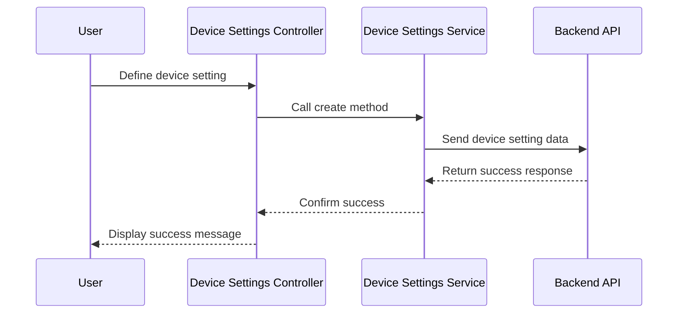

# Chapter 10: Device Configuration Management (DCM)

In the [previous chapter](09_firmware_management_.md), we explored **Firmware Management**, which is used to handle firmware files, activation versions, and distribution rules. Now, we turn our attention to **Device Configuration Management (DCM)**, a feature that focuses on managing device-specific settings, formulas, and log upload settings.

---

## Motivation: Why is Device Configuration Management (DCM) Important?

Devices in large-scale networks often require specific configurations to operate optimally. These configurations may include settings for connectivity, performance tuning, or log uploads. Managing these configurations manually for each device is inefficient and prone to errors, especially in systems with thousands of devices.

The **Device Configuration Management (DCM)** feature provides a centralized way to manage these configurations efficiently. It allows administrators to:
1. Define and manage **device settings** for specific models or groups of devices.
2. Apply **formulas** to dynamically generate configurations based on device attributes.
3. Configure **log upload settings** to control how and when devices upload logs for analysis.

For example, consider a scenario where:
- Devices of model `XYZ-123` require a specific configuration for optimal performance.
- Devices in a production environment need to upload logs every 24 hours for monitoring.

Using DCM, you can define and manage these settings in a structured way, ensuring consistency and scalability.

---

## Key Concepts

To understand how DCM works, we will break it down into three key components:
1. **Device Settings**: Manage specific settings for devices or models.
2. **Formulas**: Dynamically generate configurations based on device attributes.
3. **Log Upload Settings**: Configure how devices upload logs for monitoring and analysis.

---

### 1. Device Settings

**Device Settings** define specific configurations for a device or a group of devices. These settings are tied to device models or other attributes.

#### Example Use Case
Suppose you need to configure a specific timeout setting for devices of model `ABC-456`. Using device settings, you can define this configuration and apply it to the relevant devices.

#### How to Use Device Settings
To create or update a device setting, use the **Device Settings Controller**.

Example Code:
```javascript
vm.deviceSetting = {
    id: '',
    name: 'Timeout Configuration',
    model: 'ABC-456',
    timeout: 30
};
```

**Explanation**:
- `id`: The unique identifier for the device setting.
- `name`: A descriptive name for the setting.
- `model`: The device model the setting applies to.
- `timeout`: The timeout value (in seconds) for the devices.

Save the device setting to the backend:

```javascript
deviceSettingsService.create(vm.deviceSetting).then(function(response) {
    alertsService.successfullySaved(vm.deviceSetting.name);
}, function(error) {
    alertsService.showError(error.data.message);
});
```

**Explanation**:
- `deviceSettingsService.create`: Sends the device setting data to the backend for creation.
- On success, a success message is displayed to the user.
- On failure, an error message is shown.

---

### 2. Formulas

**Formulas** allow you to dynamically generate configurations based on device attributes (e.g., environment, hardware version).

#### Example Use Case
Suppose devices in the `Production` environment require a different configuration than devices in the `Development` environment. A formula can dynamically apply the appropriate configuration based on the device's environment attribute.

#### How to Use Formulas
To create a formula, use the **Formula Service**.

Example Code:
```javascript
var formula = {
    id: '',
    name: 'Environment-Based Configuration',
    rule: 'environment == "Production"',
    configuration: { timeout: 60 }
};
```

**Explanation**:
- `id`: The unique identifier for the formula.
- `name`: A descriptive name for the formula.
- `rule`: The condition for applying the configuration (e.g., `environment == "Production"`).
- `configuration`: The settings to apply if the rule matches.

Save the formula to the backend:

```javascript
formulaService.create(formula).then(function(response) {
    alertsService.successfullySaved(formula.name);
}, function(error) {
    alertsService.showError(error.data.message);
});
```

**Explanation**:
- `formulaService.create`: Sends the formula data to the backend for creation.
- On success, a success message is displayed to the user.
- On failure, an error message is shown.

---

### 3. Log Upload Settings

**Log Upload Settings** define how and when devices upload logs for monitoring and troubleshooting.

#### Example Use Case
Suppose production devices need to upload logs daily, while development devices upload logs weekly. Using log upload settings, you can define these schedules and apply them to the relevant devices.

#### How to Use Log Upload Settings
To create log upload settings, use the **Log Upload Settings Service**.

Example Code:
```javascript
var logUploadSetting = {
    id: '',
    name: 'Daily Log Upload',
    schedule: '24h',
    applicableDevices: ['Production']
};
```

**Explanation**:
- `id`: The unique identifier for the log upload setting.
- `name`: A descriptive name for the setting.
- `schedule`: The log upload frequency (e.g., `24h` for daily uploads).
- `applicableDevices`: The devices or environments the setting applies to.

Save the log upload setting to the backend:

```javascript
logUploadSettingsService.createLogUploadSettings(logUploadSetting).then(function(response) {
    alertsService.successfullySaved(logUploadSetting.name);
}, function(error) {
    alertsService.showError(error.data.message);
});
```

**Explanation**:
- `logUploadSettingsService.createLogUploadSettings`: Sends the log upload setting data to the backend for creation.
- On success, a success message is displayed.
- On failure, an error message is shown.

---

## Internal Implementation

Let’s explore what happens under the hood when you create a device setting.

### Step-by-Step Walkthrough

Here’s a sequence diagram for creating a device setting:



**Explanation**:
1. The user defines a device setting via the controller.
2. The controller calls the `create` method in the service.
3. The service sends the device setting data to the backend.
4. The backend processes the request and returns a success response.
5. The service confirms the success to the controller.
6. The controller displays a success message to the user.

---

### Code Implementation

#### Device Settings Service
The service is implemented in `devicesettings.service.js`:

```javascript
function create(deviceSetting) {
    return $http.post('devicesettings', deviceSetting);
}
```

**Explanation**:
- Sends a `POST` request to the `devicesettings` endpoint with the device setting data.

---

#### Formula Service
The service is implemented in `formula.service.js`:

```javascript
function create(formula) {
    return $http.post('dcm/formula', formula);
}
```

**Explanation**:
- Sends a `POST` request to the `dcm/formula` endpoint with the formula data.

---

#### Log Upload Settings Service
The service is implemented in `loguploadsettings.service.js`:

```javascript
function createLogUploadSettings(logUploadSetting) {
    return $http.post('dcm/logUploadSettings', logUploadSetting);
}
```

**Explanation**:
- Sends a `POST` request to the `dcm/logUploadSettings` endpoint with the log upload setting data.

---

## Conclusion

In this chapter, we explored **Device Configuration Management (DCM)**, which enables the centralized management of device settings, formulas, and log upload settings. We covered:
- **Device Settings**: Define and manage specific configurations for devices or models.
- **Formulas**: Dynamically apply configurations based on device attributes.
- **Log Upload Settings**: Configure log upload schedules for devices.

These tools make it easier to manage large-scale device configurations efficiently and consistently.

Next, we will explore [Namespace List Management](11_namespace_list_management_.md), which focuses on managing namespaces for the application.

---

Generated by [AI Codebase Knowledge Builder](https://github.com/The-Pocket/Tutorial-Codebase-Knowledge)