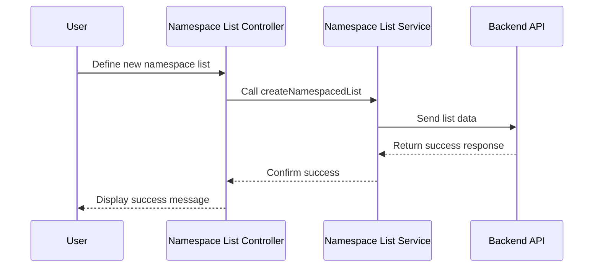

# Chapter 11: Namespace List Management

In the [previous chapter](10_device_configuration_management__dcm__.md), we explored **Device Configuration Management (DCM)**, which focuses on managing device-specific settings, formulas, and log upload configurations. Now, we will turn our attention to **Namespace List Management**, a feature that handles the creation, editing, and deletion of namespace lists.

---

## Motivation: Why is Namespace List Management Important?

Many applications require efficient management of lists of data entities, such as IP addresses, MAC addresses, or other identifiers. These lists may be used to:
1. Define groups of devices.
2. Configure rules based on specific entities.
3. Manage access control or filtering criteria.

For instance, consider a scenario where you need to maintain a list of allowed IP addresses for a specific service. As the network grows, you may need to:
- Add new IP addresses to the list.
- Remove outdated IP addresses.
- Update the list to reflect changes in the network.

Manually managing such lists can be cumbersome and error-prone, especially when the lists are large or need to be synchronized across different environments. The **Namespace List Management** feature in `xconfui` streamlines this process, allowing users to:
- Create new namespace lists.
- Edit existing lists (e.g., add or remove entries).
- Delete obsolete lists when they are no longer needed.

This feature ensures that namespace lists are managed efficiently and consistently, reducing human error and improving the overall reliability of the system.

---

## Key Concepts

To fully understand **Namespace List Management**, we will break it down into three key concepts:
1. **Creating Namespace Lists**: Define new namespace lists with specific entries.
2. **Editing Namespace Lists**: Add, remove, or update entries in an existing list.
3. **Deleting Namespace Lists**: Remove obsolete namespace lists from the system.

---

### 1. Creating Namespace Lists

The **Create Namespace List** functionality allows you to define new lists with a unique identifier and a set of entries.

#### Example Use Case
Suppose you want to create a namespace list containing a group of allowed MAC addresses. This list will be used to configure access control for a specific service.

#### How to Create a Namespace List
To create a new namespace list, use the **Namespace List Service**.

Example Code:
```javascript
var newList = {
    id: 'allowed-mac-list',
    type: 'MAC_LIST',
    data: ['00:1A:2B:3C:4D:5E', '00:1A:2B:3C:4D:5F']
};

namespacedListService.createNamespacedList(newList).then(function(response) {
    alertsService.showSuccessMessage({ message: 'Namespace List created successfully.' });
}, function(error) {
    alertsService.showError({ message: error.data.message });
});
```

**Explanation**:
- `id`: The unique identifier for the namespace list (`allowed-mac-list`).
- `type`: The type of data in the list (`MAC_LIST` for MAC addresses).
- `data`: The list of entries to include.
- `createNamespacedList`: Sends the new list data to the backend for creation.
- On success, a success message is displayed.
- On failure, an error message is shown.

---

### 2. Editing Namespace Lists

The **Edit Namespace List** functionality allows you to modify an existing namespace list. You can add new entries, remove outdated ones, or update specific values.

#### Example Use Case
Suppose the list of allowed MAC addresses needs to be updated to include a new address and remove an old one.

#### How to Edit a Namespace List
To edit an existing namespace list, retrieve the list, modify its `data`, and save the changes.

Example Code:
```javascript
namespacedListService.getNamespacedList('allowed-mac-list').then(function(response) {
    var list = response.data;
    list.data.push('00:1A:2B:3C:4D:60'); // Add new MAC address
    list.data = list.data.filter(mac => mac !== '00:1A:2B:3C:4D:5E'); // Remove old MAC address

    namespacedListService.updateNamespacedList(list, list.id).then(function() {
        alertsService.showSuccessMessage({ message: 'Namespace List updated successfully.' });
    });
});
```

**Explanation**:
- `getNamespacedList`: Fetches the existing namespace list from the backend.
- `data.push`: Adds a new entry to the list.
- `filter`: Removes an outdated entry from the list.
- `updateNamespacedList`: Sends the updated list back to the backend.
- On success, a success message is displayed.

---

### 3. Deleting Namespace Lists

The **Delete Namespace List** functionality allows you to remove obsolete lists from the system.

#### Example Use Case
Suppose the `allowed-mac-list` is no longer needed and should be deleted to avoid clutter.

#### How to Delete a Namespace List
To delete a namespace list, use the **Namespace List Service**.

Example Code:
```javascript
namespacedListService.deleteNamespacedList('allowed-mac-list').then(function() {
    alertsService.showSuccessMessage({ message: 'Namespace List deleted successfully.' });
}, function(error) {
    alertsService.showError({ message: error.data.message });
});
```

**Explanation**:
- `deleteNamespacedList`: Sends a request to the backend to delete the specified list.
- On success, a success message is displayed.
- On failure, an error message is shown.

---

## Internal Implementation

Let’s explore what happens under the hood when you create a namespace list.

### Step-by-Step Walkthrough

Here’s a sequence diagram for creating a namespace list:



**Explanation**:
1. The user defines a new namespace list in the controller.
2. The controller calls the `createNamespacedList` method in the service.
3. The service sends the list data to the backend.
4. The backend processes the request and returns a success response.
5. The service confirms the success to the controller.
6. The controller displays a success message to the user.

---

### Code Implementation

#### Namespace List Service
The service is implemented in `namespacedlist.service.js`:

```javascript
function createNamespacedList(namespacedList) {
    return $http.post('genericnamespacedlist/', namespacedList);
}

function updateNamespacedList(namespacedList, newId) {
    return $http.put('genericnamespacedlist/' + newId, namespacedList);
}

function deleteNamespacedList(id) {
    return $http.delete('genericnamespacedlist/' + id);
}
```

**Explanation**:
- `createNamespacedList`: Sends a `POST` request to create a new namespace list.
- `updateNamespacedList`: Sends a `PUT` request to update an existing namespace list.
- `deleteNamespacedList`: Sends a `DELETE` request to remove a namespace list.

---

## Conclusion

In this chapter, we explored **Namespace List Management**, which enables the creation, editing, and deletion of namespace lists. We covered:
- **Creating Namespace Lists**: Define new lists with specific entries.
- **Editing Namespace Lists**: Modify existing lists by adding, removing, or updating entries.
- **Deleting Namespace Lists**: Remove obsolete lists from the system.

These tools provide a robust framework for managing namespace lists efficiently and consistently.

In the [next chapter](12_telemetry_management_.md), we will explore **Telemetry Management**, which focuses on collecting and managing telemetry data for the application.

---

Generated by [AI Codebase Knowledge Builder](https://github.com/The-Pocket/Tutorial-Codebase-Knowledge)