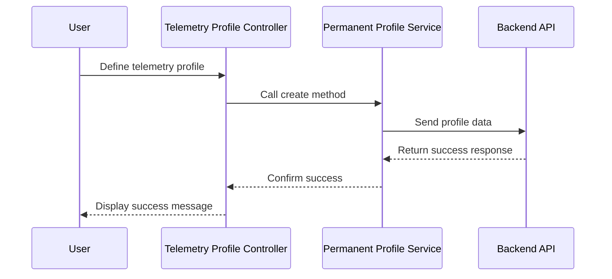

# Chapter 12: Telemetry Management

In the [previous chapter](11_namespace_list_management_.md), we explored **Namespace List Management**, which handles the creation, editing, and deletion of namespace lists efficiently. Now, we turn our attention to **Telemetry Management**, a feature that focuses on managing telemetry profiles, targeting rules, and telemetry two changes.

---

## Motivation: Why is Telemetry Management Important?

Telemetry data is crucial for understanding the behavior and performance of devices and systems. It provides insights into operational metrics, error states, and environmental conditions, which can be used for performance optimization, troubleshooting, and predictive maintenance.

Managing telemetry involves tasks such as:
1. Defining telemetry profiles to specify what data should be collected.
2. Creating targeting rules to apply telemetry configurations to specific devices or environments.
3. Managing telemetry two changes to approve, cancel, or revert updates in telemetry settings.

For example, imagine a scenario where you want to collect detailed telemetry data about network latency from devices in a production environment. You need to:
- Define a telemetry profile that specifies the metrics to be collected.
- Create targeting rules to apply this profile only to production devices.
- Manage changes to telemetry settings to ensure they are correctly approved and applied.

The **Telemetry Management** feature in `xconfui` enables these capabilities, ensuring that telemetry data is collected and managed efficiently across devices.

---

## Key Concepts

**Telemetry Management** can be broken down into three key components:
1. **Telemetry Profiles**: Define the data to be collected from devices.
2. **Targeting Rules**: Specify which devices or environments should use the telemetry profiles.
3. **Telemetry Two Changes**: Manage updates to telemetry configurations.

---

### 1. Telemetry Profiles

**Telemetry Profiles** define the specific metrics or data points to be collected from devices. This can include network latency, CPU usage, memory utilization, or other critical statistics.

#### Example Use Case
Suppose you want to create a telemetry profile to collect network latency and error rates from devices. This profile will define the metrics to be collected.

#### How to Create a Telemetry Profile
To create a new telemetry profile, use the **Permanent Profile Service**.

Example Code:
```javascript
var telemetryProfile = {
    id: 'network-metrics-profile',
    name: 'Network Metrics',
    metrics: ['latency', 'error_rate']
};

permanentProfileService.create(telemetryProfile).then(function(response) {
    alertsService.showSuccessMessage({ message: 'Telemetry Profile created successfully.' });
}, function(error) {
    alertsService.showError({ message: error.data.message });
});
```

**Explanation**:
- `id`: The unique identifier for the telemetry profile.
- `name`: A descriptive name for the profile.
- `metrics`: The list of metrics to be collected (e.g., `latency`, `error_rate`).
- `create`: Sends the profile data to the backend for creation.
- On success, a success message is displayed.
- On failure, an error message is shown.

---

### 2. Targeting Rules

**Targeting Rules** specify which devices or environments should use the telemetry profiles. This ensures that telemetry configurations are applied only to the intended targets.

#### Example Use Case
Suppose you want to apply the "Network Metrics" telemetry profile only to devices in the production environment. A targeting rule can be created for this purpose.

#### How to Create a Targeting Rule
To create a targeting rule, use the **Targeting Rule Service**.

Example Code:
```javascript
var targetingRule = {
    id: 'production-targeting-rule',
    name: 'Production Devices',
    condition: 'environment == "Production"',
    telemetryProfileId: 'network-metrics-profile'
};

targetingRuleService.create(targetingRule).then(function(response) {
    alertsService.showSuccessMessage({ message: 'Targeting Rule created successfully.' });
}, function(error) {
    alertsService.showError({ message: error.data.message });
});
```

**Explanation**:
- `id`: The unique identifier for the targeting rule.
- `name`: A descriptive name for the rule.
- `condition`: The condition specifying which devices the rule applies to (e.g., `environment == "Production"`).
- `telemetryProfileId`: The ID of the telemetry profile to apply.
- `create`: Sends the rule data to the backend for creation.
- On success, a success message is displayed.
- On failure, an error message is shown.

---

### 3. Telemetry Two Changes

**Telemetry Two Changes** allow administrators to approve, cancel, or revert updates to telemetry configurations. This ensures that changes are reviewed and applied only when appropriate.

#### Example Use Case
Suppose a new telemetry configuration has been proposed for approval. You need to review and approve the change before it is applied to devices.

#### How to Approve a Telemetry Change
To approve a telemetry change, use the **Telemetry Two Change Service**.

Example Code:
```javascript
telemetryTwoChangeService.approve('change-id-123').then(function() {
    alertsService.showSuccessMessage({ message: 'Telemetry Change approved successfully.' });
}, function(error) {
    alertsService.showError({ message: error.data.message });
});
```

**Explanation**:
- `approve`: Approves the telemetry change with the specified ID (`change-id-123`).
- On success, a success message is displayed.
- On failure, an error message is shown.

---

## Internal Implementation

Let’s explore what happens under the hood when you create a telemetry profile.

### Step-by-Step Walkthrough

Here’s a sequence diagram for creating a telemetry profile:



**Explanation**:
1. The user defines a telemetry profile in the controller.
2. The controller calls the `create` method in the service.
3. The service sends the profile data to the backend.
4. The backend processes the request and returns a success response.
5. The service confirms the success to the controller.
6. The controller displays a success message to the user.

---

### Code Implementation

#### Permanent Profile Service
Located in `app/xconf/telemetry/permanentprofile/permanentprofile.service.js`:

```javascript
function create(profile) {
    return $http.post('telemetry/profile/', profile);
}
```

**Explanation**:
- Sends a `POST` request to the `telemetry/profile/` endpoint with the profile data.

---

#### Targeting Rule Service
Located in `app/xconf/telemetry/targetingrule/targetingrule.service.js`:

```javascript
function create(targetingRule) {
    return $http.post('telemetry/rule/', targetingRule);
}
```

**Explanation**:
- Sends a `POST` request to the `telemetry/rule/` endpoint with the targeting rule data.

---

#### Telemetry Two Change Service
Located in `app/xconf/telemetrytwochanges/telemetrytwochange.service.js`:

```javascript
function approve(changeId) {
    return $http.get('telemetry/v2/change/approve/' + changeId);
}
```

**Explanation**:
- Sends a `GET` request to the `telemetry/v2/change/approve/` endpoint with the change ID.

---

## Conclusion

In this chapter, we explored **Telemetry Management**, which enables the creation and management of telemetry profiles, targeting rules, and telemetry two changes. We covered:
- **Telemetry Profiles**: Define the data to be collected from devices.
- **Targeting Rules**: Apply telemetry configurations to specific devices or environments.
- **Telemetry Two Changes**: Manage updates to telemetry settings through approval, cancellation, or reversion.

These tools provide a robust framework for collecting and managing telemetry data efficiently.

Next, we will dive into [Settings and Rules Management](13_settings_and_rules_management_.md), which focuses on managing settings and rules for various configurations.

---

Generated by [AI Codebase Knowledge Builder](https://github.com/The-Pocket/Tutorial-Codebase-Knowledge)