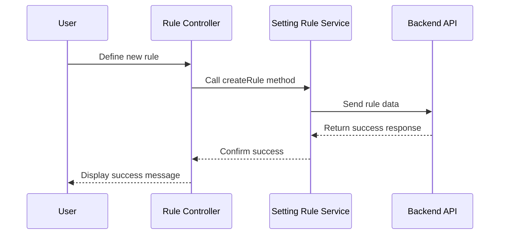

# Chapter 13: Settings and Rules Management

In the [previous chapter](12_telemetry_management_.md), we explored **Telemetry Management**, which focuses on managing telemetry profiles, targeting rules, and telemetry changes. Now, we turn our attention to **Settings and Rules Management**, a feature that enables the creation, editing, and application of settings profiles and rules to manage configurations across devices and environments.

---

## Motivation: Why is Settings and Rules Management Important?

Modern systems often require precise control over configurations applied to devices or environments. These configurations—such as performance settings, feature toggles, or access controls—need to be managed centrally to ensure consistency and scalability. **Settings and Rules Management** provides a structured way to define and apply these configurations through two key abstractions:
1. **Settings Profiles**: Define reusable sets of configurations.
2. **Rules**: Specify conditions that determine when and where settings profiles are applied.

For example, consider a scenario where:
- Devices in the `Development` environment need specific debug settings enabled.
- Devices in the `Production` environment require optimized performance settings.

Using **Settings and Rules Management**, you can:
- Create a settings profile for debug configurations.
- Create another profile for production optimization.
- Define rules to apply these profiles based on the device's environment.

This abstraction simplifies configuration management, reduces errors, and ensures devices operate according to the intended settings.

---

## Key Concepts

To fully understand **Settings and Rules Management**, we will break it down into two main components:
1. **Settings Profiles**: A reusable collection of configurations.
2. **Rules**: Conditional logic to determine when settings profiles are applied.

---

### 1. Settings Profiles

**Settings Profiles** are reusable collections of configurations that can be applied to devices. Each profile contains settings tailored to specific use cases.

#### Example Use Case
Suppose you want to enable detailed logging for devices in the `Development` environment. A settings profile can define this configuration.

#### How to Create a Settings Profile
To create a new settings profile, use the **Setting Profile Service**.

Example Code:
```javascript
var settingsProfile = {
    id: 'debug-logging-profile',
    description: 'Enable detailed logging for debugging',
    settings: { loggingLevel: 'DEBUG' }
};

settingProfileService.create(settingsProfile).then(function(response) {
    alertsService.showSuccessMessage({ message: 'Settings Profile created successfully.' });
}, function(error) {
    alertsService.showError({ message: error.data.message });
});
```

**Explanation**:
- `id`: The unique identifier for the settings profile (`debug-logging-profile`).
- `description`: A brief description of the profile.
- `settings`: The configurations defined in the profile, such as `loggingLevel: DEBUG`.
- `create`: Sends the profile data to the backend for creation.
- On success, a success message is displayed.
- On failure, an error message is shown.

---

### 2. Rules

**Rules** define conditions that determine when and where settings profiles are applied. Each rule links a condition (e.g., device environment) to a settings profile.

#### Example Use Case
Suppose you want to apply the "Debug Logging Profile" only to devices in the `Development` environment. A rule can specify this condition.

#### How to Create a Rule
To create a rule, use the **Setting Rule Service**.

Example Code:
```javascript
var rule = {
    id: 'development-debug-rule',
    name: 'Development Debugging Rule',
    condition: 'environment == "Development"',
    settingsProfileId: 'debug-logging-profile'
};

settingRuleService.createRule(rule).then(function(response) {
    alertsService.showSuccessMessage({ message: 'Rule created successfully.' });
}, function(error) {
    alertsService.showError({ message: error.data.message });
});
```

**Explanation**:
- `id`: The unique identifier for the rule (`development-debug-rule`).
- `name`: A descriptive name for the rule.
- `condition`: The condition specifying when the rule applies (e.g., `environment == "Development"`).
- `settingsProfileId`: The ID of the associated settings profile.
- `createRule`: Sends the rule data to the backend for creation.
- On success, a success message is displayed.
- On failure, an error message is shown.

---

## Internal Implementation

Let’s explore what happens under the hood when a rule is created.

### Step-by-Step Walkthrough

Here’s a sequence diagram for creating a rule:



**Explanation**:
1. The user defines a new rule in the controller.
2. The controller calls the `createRule` method in the service.
3. The service sends the rule data to the backend.
4. The backend processes the request and returns a success response.
5. The service confirms the success to the controller.
6. The controller displays a success message to the user.

---

### Code Implementation

#### Setting Profile Service
The service is implemented in `settingprofile.service.js`:

```javascript
function create(profile) {
    return $http.post('settingprofile/', profile);
}
```

**Explanation**:
- Sends a `POST` request to the `settingprofile/` endpoint with the profile data.

---

#### Setting Rule Service
The service is implemented in `settingrule.service.js`:

```javascript
function createRule(rule) {
    return $http.post('setting/rule/', rule);
}
```

**Explanation**:
- Sends a `POST` request to the `setting/rule/` endpoint with the rule data.

---

## Conclusion

In this chapter, we explored **Settings and Rules Management**, which enables efficient creation and application of settings profiles and rules. We covered:
- **Settings Profiles**: Define reusable collections of configurations.
- **Rules**: Apply settings profiles conditionally based on device attributes.

These abstractions provide a powerful framework for managing configurations across devices and environments.

In the [next chapter](14_authorization_system_.md), we will explore **Authorization System**, which focuses on managing user access and permissions.

---

Generated by [AI Codebase Knowledge Builder](https://github.com/The-Pocket/Tutorial-Codebase-Knowledge)