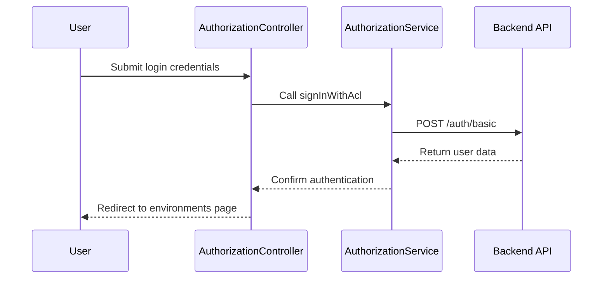

# Chapter 14: Authorization System

In the [previous chapter](13_settings_and_rules_management_.md), we explored **Settings and Rules Management**, which focuses on defining and applying settings profiles and rules to manage configurations. In this chapter, we will delve into the **Authorization System**, a key feature for managing user access and permissions within the `xconfui` application.

---

## Motivation: Why is the Authorization System Important?

In any application, controlling who can access certain features and data is critical for security and proper functionality. The **Authorization System** in `xconfui` ensures that only authorized users can perform specific actions or access restricted areas. This mechanism is especially important in environments where sensitive configurations, such as device settings or telemetry data, must be protected from unauthorized access.

### Example Use Case
Imagine a scenario where:
1. An administrator needs to log in to manage device configurations.
2. Unauthorized users should not be able to access the application's environment settings or modify critical data.

The **Authorization System** ensures that:
- Users are authenticated before accessing the application.
- Role-based access control (RBAC) is enforced to allow or deny access to certain features based on user roles.

The system is implemented using mechanisms like login forms, authentication providers, and session management, ensuring a seamless yet secure user experience.

---

## Key Concepts

The **Authorization System** is built around the following key concepts:
1. **Authentication**: Verifying the user's identity through login credentials.
2. **Authorization**: Granting or denying access to specific resources based on user roles.
3. **Session Management**: Maintaining the user's authenticated state across pages.

Let’s explore each concept in detail.

---

### 1. Authentication

Authentication is the process of verifying a user's identity. In `xconfui`, users log in with their credentials (e.g., username and password) to gain access to the system.

#### How Authentication Works
When a user submits their login credentials:
1. The credentials are sent to the backend for validation.
2. If valid, the user is authenticated, and a session is created.
3. If invalid, an error message is displayed.

#### Example: Logging in as a User
The login functionality is handled by the `AuthorizationController`.

Example Code:
```javascript
vm.credentials = {
    login: 'admin',
    password: 'password123'
};

vm.signInWithAcl = function() {
    authorizationService.signInWithAcl(vm.credentials).then(function(resp) {
        $rootScope.currentUser = resp.data;
        $state.go('environments');
    }, function(error) {
        alertsService.showError({title: 'Authorization Error', message: error.data});
    });
};
```

**Explanation**:
- `vm.credentials`: Stores the user's login credentials.
- `signInWithAcl`: Sends the user's credentials to the backend for authentication.
- On success, the user is redirected to the `environments` page.
- On failure, an error message is displayed.

---

### 2. Authorization

Authorization determines what actions a user can perform based on their role. For example, an administrator may have access to all features, while a regular user may be restricted to read-only access.

#### Example: Redirecting Unauthorized Users
The system checks whether a user is authorized before granting access to certain pages.

Example Code:
```javascript
if (authUtils.isAuthorized()) {
    $state.go('environments');
} else {
    alertsService.showError({title: 'Access Denied', message: 'You are not authorized to access this section.'});
}
```

**Explanation**:
- `authUtils.isAuthorized`: Checks if the user is authorized.
- If authorized, the user is redirected to the `environments` page.
- If not authorized, an error message is displayed.

---

### 3. Session Management

Session management ensures that the user's authenticated state is maintained across pages. If the user logs out or their session expires, they must log in again to access the application.

#### Example: Logging Out
The `aclSignOut` method is used to log the user out and end the session.

Example Code:
```javascript
authorizationService.aclSignOut().then(function() {
    $rootScope.currentUser = null;
    $state.go('login');
});
```

**Explanation**:
- `aclSignOut`: Ends the user's session by logging them out.
- The user is redirected to the login page.

---

## Internal Implementation

Let’s explore what happens under the hood when a user logs in.

### Step-by-Step Walkthrough

Here’s a sequence diagram for the login process:



**Explanation**:
1. The user submits their login credentials via the controller.
2. The controller calls the `signInWithAcl` method in the service.
3. The service sends the credentials to the backend for validation.
4. The backend validates the credentials and returns user data if successful.
5. The service confirms authentication to the controller.
6. The controller redirects the user to the `environments` page.

---

### Code Implementation

#### Authorization Controller
The controller is implemented in `authorization.controller.js`:

```javascript
function signInWithAcl() {
    authorizationService.signInWithAcl(vm.credentials).then(function(resp) {
        $rootScope.currentUser = resp.data;
        $state.go('environments');
    }, function(error) {
        alertsService.showError({title: 'Authorization Error', message: error.data});
    });
}
```

**Explanation**:
- Calls the `signInWithAcl` method in the service to authenticate the user.
- On success, sets the authenticated user in `$rootScope.currentUser` and redirects to the `environments` page.
- On failure, displays an error message.

---

#### Authorization Service
The service is implemented in `authorization.service.js`:

```javascript
function signInWithAcl(credentials) {
    return $http.post('/auth/basic', credentials);
}
```

**Explanation**:
- Sends the user's credentials to the `/auth/basic` endpoint for authentication.
- Returns the backend's response to the controller.

---

## Conclusion

In this chapter, we explored the **Authorization System**, which ensures secure access control in the `xconfui` application. We covered:
- **Authentication**: Verifying user credentials and granting access.
- **Authorization**: Enforcing role-based permissions.
- **Session Management**: Maintaining the user's authenticated state.

These mechanisms ensure that only authorized users can access the application, enhancing security and functionality.

In the [next chapter](15_server_utilities_.md), we will explore **Server Utilities**, which provide essential tools for server-side operations.

---

Generated by [AI Codebase Knowledge Builder](https://github.com/The-Pocket/Tutorial-Codebase-Knowledge)