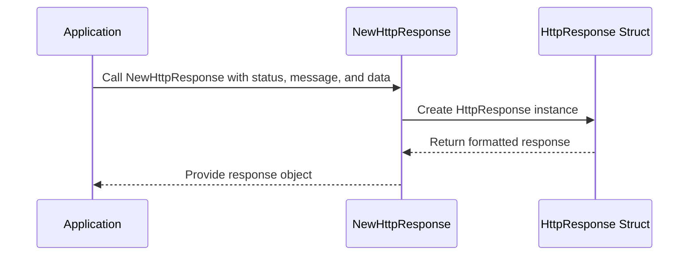

# Chapter 15: Server Utilities

In the [previous chapter](14_authorization_system_.md), we explored the **Authorization System**, which ensures secure access control and manages user permissions. In this chapter, we will focus on **Server Utilities**, a collection of helper functions and constants that play a crucial role in the server's internal operations.

---

## Motivation: Why Are Server Utilities Important?

Server-side applications often rely on shared utility functions and constants to streamline development, ensure consistency, and simplify repetitive tasks. These utilities encapsulate common operations, making them reusable and easy to maintain.

The **Server Utilities** abstraction in `xconfui` serves two main purposes:
1. **Provide Constants**: Define values like logging formats and version metadata, which are used across the server.
2. **Simplify Common Operations**: Offer reusable helper functions for key tasks such as constructing HTTP responses.

### Example Use Case
Imagine the server needs to:
- Return a JSON-formatted HTTP response with a status code, message, and optional data.
- Log events consistently with a defined timestamp format.
- Provide metadata about the server's binary version, build time, and branch.

Instead of implementing these features repeatedly in different parts of the codebase, **Server Utilities** centralize them, ensuring consistency and reducing redundancy.

---

## Key Concepts

To understand **Server Utilities**, we will break it down into the following key concepts:
1. **Constants**: Shared values used across the server.
2. **Reusable Structures**: Predefined structs for common server operations.
3. **Helper Functions**: Functions that simplify tasks like HTTP response construction.

---

### 1. Constants

Constants provide shared values that are used consistently across the server. For example, the `LoggingTimeFormat` constant defines the timestamp format for logs.

#### Example: Using Logging Constants
```go
const (
    LoggingTimeFormat = "2006-01-02 15:04:05.000"
)
```

**Explanation**:
- `LoggingTimeFormat`: A constant defining the format for timestamps in logs. This ensures that all logs use a consistent, human-readable format (e.g., `2024-01-01 12:00:00.123`).

This constant is used wherever timestamp formatting is required in the server, ensuring uniformity across log entries.

---

### 2. Reusable Structures

Reusable structures help organize and return data in a consistent format. For example, the `HttpResponse` struct is used to construct HTTP responses.

#### Example: Defining the `HttpResponse` Struct
```go
type HttpResponse struct {
    Status  int         `json:"status"`
    Message string      `json:"message,omitempty"`
    Data    interface{} `json:"data,omitempty"`
}
```

**Explanation**:
- `Status`: Represents the HTTP status code (e.g., `200` for OK, `404` for Not Found).
- `Message`: An optional message describing the response (e.g., "Operation successful").
- `Data`: An optional field for including additional data (e.g., JSON objects or arrays).

This structure ensures that HTTP responses are consistently formatted as JSON objects, making them easy to parse by clients.

---

### 3. Helper Functions

Helper functions simplify common tasks, such as constructing HTTP responses or providing metadata about the server's binary version.

#### Example: Constructing an HTTP Response
```go
func NewHttpResponse(status int, message string, data interface{}) HttpResponse {
    return HttpResponse{
        Status:  status,
        Message: message,
        Data:    data,
    }
}
```

**Explanation**:
- `status`: The HTTP status code to be included in the response.
- `message`: A brief message describing the result of the operation.
- `data`: Optional data to include in the response.

**Example Usage**:
```go
response := NewHttpResponse(200, "Success", map[string]string{"key": "value"})
```

**Output**:
The `response` variable contains:
```json
{
    "status": 200,
    "message": "Success",
    "data": {
        "key": "value"
    }
}
```

This helper function ensures that HTTP responses are consistently formatted and easy to construct.

---

## Internal Implementation

Let’s explore what happens under the hood when a helper function like `NewHttpResponse` is called.

### Step-by-Step Walkthrough

Here is a simplified sequence diagram for constructing an HTTP response:



**Explanation**:
1. The application calls `NewHttpResponse`, passing the status, message, and data as arguments.
2. The function creates a new instance of the `HttpResponse` struct.
3. The struct is populated with the provided values.
4. The function returns the formatted response object to the application.

---

### Code Implementation

#### Constants
The constants are defined in `server/common/const_var.go`:
```go
const (
    LoggingTimeFormat = "2006-01-02 15:04:05.000"
)
```

**Explanation**:
- This file centralizes shared constants, such as the logging timestamp format.

---

#### Version Metadata
The `Version` struct provides metadata about the server's binary version, branch, and build time. It is defined in the same file:

```go
type Version struct {
    CodeGitCommit   string `json:"code_git_commit"`
    BuildTime       string `json:"build_time"`
    BinaryVersion   string `json:"binary_version"`
    BinaryBranch    string `json:"binary_branch"`
    BinaryBuildTime string `json:"binary_build_time"`
}
```

**Explanation**:
- `CodeGitCommit`: The commit hash used to build the binary.
- `BuildTime`: The time when the binary was built.
- `BinaryVersion`: The version of the binary.
- `BinaryBranch`: The branch from which the binary was built.
- `BinaryBuildTime`: Additional build time information.

This struct is used to provide version metadata to clients or logs.

---

#### HTTP Response Construction
The `HttpResponse` struct and its associated helper function are also defined in `server/common/const_var.go`:

```go
func NewHttpResponse(status int, message string, data interface{}) HttpResponse {
    return HttpResponse{
        Status:  status,
        Message: message,
        Data:    data,
    }
}
```

**Explanation**:
- This function streamlines the creation of HTTP responses, ensuring they follow a consistent format.

---

## Conclusion

In this chapter, we explored **Server Utilities**, a collection of helper functions and constants essential for server-side operations. We covered:
- **Constants**: Shared values like logging formats and version metadata.
- **Reusable Structures**: Predefined structs for tasks like HTTP response construction.
- **Helper Functions**: Simplified methods for creating consistent HTTP responses.

These utilities ensure consistency, reusability, and maintainability across the server's codebase.

In the [next chapter](16_application_modules_.md), we will explore **Application Modules**, which organize and structure the application's core features.

---

Generated by [AI Codebase Knowledge Builder](https://github.com/The-Pocket/Tutorial-Codebase-Knowledge)