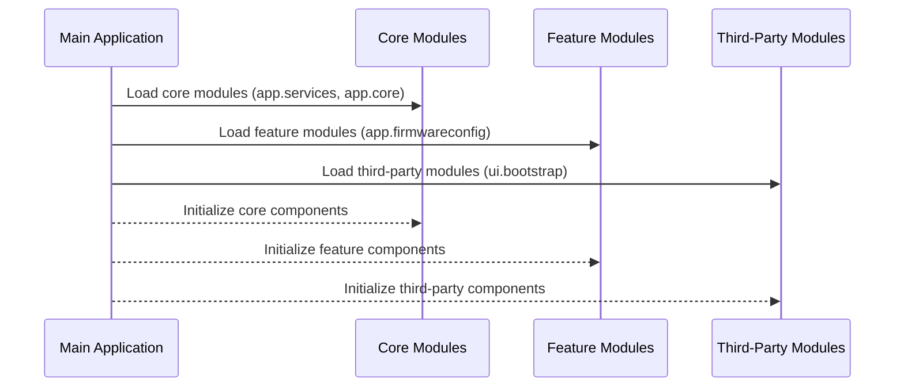

# Chapter 16: Application Modules

In the [previous chapter](15_server_utilities_.md), we explored **Server Utilities**, a set of helper functions and constants that support server-side operations. Now, we will focus on **Application Modules**, a critical abstraction for organizing and structuring the `xconfui` application using AngularJS modules.

---

## Motivation: Why Are Application Modules Important?

Modern web applications, especially those with numerous features, can become complex and difficult to manage. As the codebase grows, separating it into logical units helps improve maintainability, scalability, and collaboration. In AngularJS, **modules** provide a way to organize the application into distinct, cohesive blocks. 

### Example Use Case
Imagine the `xconfui` application, which includes features such as firmware management, device settings, telemetry profiles, and authorization. Without proper organization, these features could be scattered across a single codebase, making it challenging to:
1. Locate specific functionality.
2. Reuse components effectively.
3. Maintain consistency across the application.

By using **Application Modules**, each feature or service is encapsulated within its own module. This ensures that:
- Features are self-contained and reusable.
- Dependencies are clearly defined and managed.
- The application structure is logical and easy to navigate.

---

## Key Concepts

To understand how **Application Modules** work in the `xconfui` project, we will break it down into the following concepts:
1. **Core Modules**: Shared functionality available across the application.
2. **Feature Modules**: Self-contained modules for specific features.
3. **Third-Party Modules**: External libraries integrated into the application.

---

### 1. Core Modules

**Core Modules** contain functionality shared across the entire application. These modules include services, utility functions, and other reusable components. For instance:
- `app.services`: Provides general-purpose services like HTTP requests and alerts.
- `app.core`: Contains foundational abstractions used by multiple features.

#### Example: Defining a Core Module
Core modules are defined using AngularJS's `angular.module` function. Here’s how the `app.services` module is created:

```javascript
(function() {
    'use strict';

    angular.module('app.services', []);
})();
```

**Explanation**:
- `angular.module('app.services', [])`: Registers a new module named `app.services`. The second argument (`[]`) specifies that this module has no dependencies.
- This module acts as a container for services shared across the application.

Once defined, services like `alertsService` can be added to this module and accessed by other modules that depend on it.

---

### 2. Feature Modules

**Feature Modules** encapsulate functionality related to specific application features. For example:
- `app.firmwareconfig`: Manages firmware configurations.
- `app.telemetrytwoprofile`: Handles telemetry profiles.

Each feature module contains its own controllers, services, and directives, ensuring that the code is modular and self-contained.

#### Example: Defining a Feature Module
Here’s how the `app.firmwareconfig` module is defined:

```javascript
(function() {
    'use strict';

    angular.module('app.firmwareconfig', []);
})();
```

**Explanation**:
- `angular.module('app.firmwareconfig', [])`: Creates a module dedicated to firmware configurations.
- This module can define its own components, such as controllers and services, without affecting other parts of the application.

Feature modules are then integrated into the main application module, ensuring a clear separation of concerns.

---

### 3. Third-Party Modules

**Third-Party Modules** integrate external libraries that provide additional functionality, such as UI components or data handling. For example:
- `ui.bootstrap`: Provides Bootstrap components for AngularJS.
- `ngCookies`: Manages browser cookies.
- `ngAnimate`: Enables animations for AngularJS directives.

#### Example: Adding a Third-Party Module
To use `ui.bootstrap`, it is added as a dependency in the main application module:

```javascript
angular.module('app', [
    'ui.bootstrap'
]);
```

**Explanation**:
- `ui.bootstrap`: Enables the application to use Bootstrap components, such as modals and dropdowns, within AngularJS.

By including third-party modules, the application can leverage existing tools and libraries to enhance functionality.

---

## How Application Modules Work Together

The main `app` module ties all core, feature, and third-party modules together. It defines the application’s dependencies and ensures that all modules are loaded properly.

#### Example: Main Application Module
Here’s the definition of the `app` module:

```javascript
(function() {
    'use strict';

    angular.module('app', [
        'app.services',
        'app.core',
        'app.firmwareconfig',
        'app.telemetrytwoprofile',
        'ui.bootstrap',
        'ngAnimate'
    ]);
})();
```

**Explanation**:
- `'app.services'` and `'app.core'`: Core modules shared across the application.
- `'app.firmwareconfig'` and `'app.telemetrytwoprofile'`: Feature modules for firmware configurations and telemetry profiles.
- `'ui.bootstrap'` and `'ngAnimate'`: Third-party modules for UI components and animations.

By defining dependencies clearly, the `app` module ensures that all required modules are available and initialized when the application starts.

---

## Internal Implementation

Let’s explore what happens under the hood when the application initializes its modules.

### Step-by-Step Walkthrough

Here’s a sequence diagram illustrating the initialization process:



**Explanation**:
1. The main application (`app`) loads its dependencies, including core, feature, and third-party modules.
2. Each module is initialized in the order specified in the `app` module’s dependency list.
3. Once all modules are initialized, the application is ready to run.

---

### Code Implementation

#### Main Application Module
Located in `app/xconf/app.module.js`:

```javascript
(function() {
    'use strict';

    angular.module('app', [
        'app.services',
        'app.core',
        'app.firmwareconfig',
        'ui.bootstrap',
        'ngAnimate'
    ]);
})();
```

**Explanation**:
- Registers the `app` module and specifies its dependencies.

---

#### Feature Module Example
Located in `app/xconf/firmwareconfig/firmwareconfig.module.js`:

```javascript
(function() {
    'use strict';

    angular.module('app.firmwareconfig', []);
})();
```

**Explanation**:
- Defines the `app.firmwareconfig` module for firmware configurations.

---

## Conclusion

In this chapter, we explored **Application Modules**, which organize and structure the `xconfui` application using AngularJS modules. We covered:
- **Core Modules**: Shared functionality available across the application.
- **Feature Modules**: Self-contained modules for specific features.
- **Third-Party Modules**: External libraries integrated into the application.

By leveraging **Application Modules**, the `xconfui` application achieves a modular, maintainable architecture that simplifies development and collaboration.

In the [next chapter](17_pagination_utility_.md), we will explore **Pagination Utility**, a feature that helps manage large datasets efficiently.

---

Generated by [AI Codebase Knowledge Builder](https://github.com/The-Pocket/Tutorial-Codebase-Knowledge)