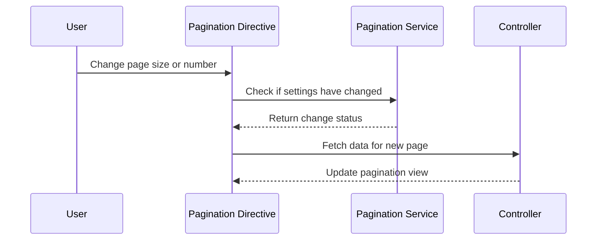

# Chapter 17: Pagination Utility

In the [previous chapter](16_application_modules_.md), we explored **Application Modules**, which help organize the `xconfui` application into modular and maintainable blocks. In this chapter, we will focus on the **Pagination Utility**, an essential abstraction for managing large datasets efficiently by breaking them into smaller, more manageable pages.

---

## Motivation: Why is Pagination Utility Important?

Applications dealing with large datasets often face challenges in presenting this data to users efficiently. Loading and displaying all records at once can overwhelm the user interface and degrade performance. **Pagination Utility** solves this problem by dividing datasets into smaller pages, allowing users to navigate through data in a controlled and efficient manner.

### Example Use Case
Imagine a scenario where you need to display a list of devices that spans thousands of entries. Instead of rendering all entries on a single page:
1. The data is divided into pages, each containing a fixed number of entries (e.g., 50 entries per page).
2. Users can navigate between pages (e.g., "Next", "Previous") to view additional data.
3. Users can adjust the page size (e.g., show 10, 50, or 100 entries per page).

The **Pagination Utility** in `xconfui` provides a reusable directive and service to handle this functionality seamlessly. It supports:
- Dynamic page sizes.
- Efficient navigation between pages.
- Persistent storage of pagination preferences.

---

## Key Concepts

The **Pagination Utility** is built using two primary components:
1. **Pagination Directive**: A reusable AngularJS directive for rendering pagination controls.
2. **Pagination Service**: A service that manages pagination logic, such as retrieving page sizes and storing user preferences.

Let’s explore each component in detail.

---

### 1. Pagination Directive

The **Pagination Directive** is responsible for rendering the pagination controls in the user interface. It provides options for:
- Navigating between pages.
- Adjusting the number of entries displayed per page.

#### How to Use the Pagination Directive

To include the pagination controls in your view, use the `xconfPagination` directive. Bind it to the required properties and methods in your controller.

Example HTML:
```html
<xconf-pagination 
    page-size="vm.pageSize" 
    page-number="vm.pageNumber" 
    pagination-storage-key="'devicePaginationKey'" 
    get-page="vm.getPage()" 
    get-general-items-number="vm.getItemCount()">
</xconf-pagination>
```

**Explanation**:
- `page-size`: Binds the directive to the current page size (e.g., 50 entries per page).
- `page-number`: Binds the directive to the current page number (e.g., page 1).
- `pagination-storage-key`: Specifies a unique key for storing pagination preferences.
- `get-page`: Calls a function to fetch data for the current page.
- `get-general-items-number`: Calls a function to retrieve the total number of items.

#### Example Controller Code

In your AngularJS controller, define the properties and methods required by the directive:

```javascript
vm.pageSize = 50;
vm.pageNumber = 1;

vm.getPage = function() {
    console.log('Fetching data for page', vm.pageNumber, 'with size', vm.pageSize);
};

vm.getItemCount = function() {
    return 1000; // Total number of items (example value)
};
```

**Explanation**:
- `pageSize` and `pageNumber`: Track the current page size and number.
- `getPage`: Fetches data for the current page. This function can make an API call to retrieve the data.
- `getItemCount`: Returns the total number of items, which is used to calculate the total number of pages.

---

### 2. Pagination Service

The **Pagination Service** handles the logic behind the pagination controls. It provides methods for:
- Retrieving available page sizes.
- Storing and retrieving user preferences for page size.
- Validating and updating pagination settings.

#### Key Methods

Here are some important methods provided by the `paginationService`:

1. **getAvailablePageSizes**:
   Returns the list of available page sizes (e.g., 10, 50, 100).

   Example:
   ```javascript
   var pageSizes = paginationService.getAvailablePageSizes();
   console.log(pageSizes); // Output: [10, 50, 100, 200]
   ```

2. **getPageSize**:
   Retrieves the current page size from user preferences or defaults.

   Example:
   ```javascript
   var pageSize = paginationService.getPageSize('devicePaginationKey');
   console.log(pageSize); // Output: 50 (example)
   ```

3. **saveDefaultPageSize**:
   Saves the user's preferred page size.

   Example:
   ```javascript
   paginationService.saveDefaultPageSize(100, 'devicePaginationKey');
   ```

4. **paginationSettingsInLocationHaveChanged**:
   Checks if the current page size or number has changed.

   Example:
   ```javascript
   var hasChanged = paginationService.paginationSettingsInLocationHaveChanged(1, 50);
   console.log(hasChanged); // Output: true or false
   ```

---

## Internal Implementation

Let’s explore what happens under the hood when a user interacts with the pagination controls.

### Step-by-Step Walkthrough

Here’s a sequence diagram illustrating the process:



**Explanation**:
1. The user interacts with the pagination controls (e.g., changes the page size or navigates to a new page).
2. The directive checks with the service whether the pagination settings have changed.
3. If changes are detected, the directive notifies the controller to fetch data for the new page.
4. The controller updates the pagination view with the new data.

---

### Code Implementation

#### Pagination Directive
The directive is implemented in `app/shared/directives/pagination/pagination.directive.js`:

```javascript
angular.module('app.directives').directive('xconfPagination', function($timeout, paginationService) {
    return {
        restrict: 'E',
        scope: {
            pageSize: '=',
            pageNumber: '=',
            paginationStorageKey: '=',
            getPage: '&',
            getGeneralItemsNumber: '&'
        },
        templateUrl: 'app/shared/directives/pagination/pagination.directive.html',
        link: function(scope) {
            scope.availablePageSizes = paginationService.getAvailablePageSizes();

            scope.$watch('pageSize', function() {
                $timeout(function() {
                    if (paginationService.paginationSettingsInLocationHaveChanged(scope.pageNumber, scope.pageSize)) {
                        paginationService.saveDefaultPageSize(scope.pageSize, scope.paginationStorageKey);
                        scope.getPage();
                    }
                }, 0);
            });

            scope.$watch('pageNumber', function() {
                if (paginationService.paginationSettingsInLocationHaveChanged(scope.pageNumber, scope.pageSize)) {
                    scope.getPage();
                }
            });
        }
    };
});
```

**Explanation**:
- The directive watches `pageSize` and `pageNumber` for changes.
- When changes occur, it calls the `getPage` method to fetch the new data.

---

#### Pagination Service
The service is implemented in `app/shared/services/pagination.service.js`:

```javascript
function PaginationService($localStorage, $location) {
    var availablePageSizes = [10, 50, 100, 200];
    var defaultPageSize = 50;

    function getAvailablePageSizes() {
        return availablePageSizes;
    }

    function getPageSize(storageKey) {
        return $localStorage[storageKey] || defaultPageSize;
    }

    function saveDefaultPageSize(pageSize, storageKey) {
        $localStorage[storageKey] = pageSize;
    }

    return {
        getAvailablePageSizes: getAvailablePageSizes,
        getPageSize: getPageSize,
        saveDefaultPageSize: saveDefaultPageSize
    };
}
angular.module('app.services').factory('paginationService', PaginationService);
```

**Explanation**:
- `getAvailablePageSizes`: Returns the list of page sizes.
- `getPageSize`: Retrieves the current page size from user preferences or defaults.
- `saveDefaultPageSize`: Saves the user's preferred page size to local storage.

---

## Conclusion

In this chapter, we explored the **Pagination Utility**, which enables efficient management of large datasets by dividing them into smaller, navigable pages. We covered:
- **Pagination Directive**: A reusable UI component for rendering pagination controls.
- **Pagination Service**: A backend utility for managing pagination preferences and logic.

These tools ensure that datasets are presented in a user-friendly and efficient manner. 

In the [next chapter](18_file_management_features_.md), we will explore **File Management Features**, which focus on handling file uploads, downloads, and management.

---

Generated by [AI Codebase Knowledge Builder](https://github.com/The-Pocket/Tutorial-Codebase-Knowledge)