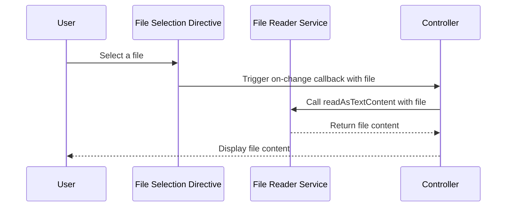

# Chapter 18: File Management Features

In the [previous chapter](17_pagination_utility_.md), we explored the **Pagination Utility**, which helps in managing large datasets by breaking them into smaller, navigable pages. Now, we will focus on **File Management Features**, which provide services and directives for selecting and reading files in the `xconfui` application.

---

## Motivation: Why Are File Management Features Important?

In modern web applications, file handling is a common requirement. Users often need to upload files, preview their contents, or use the data within the application. For example:
- A user uploads a firmware configuration file to apply settings to devices.
- The application needs to validate and process the file's contents before proceeding.

Manually managing file uploads and reads can be tedious, as it involves handling browser-specific behavior, tracking file selection events, and processing file data asynchronously. **File Management Features** simplify this process by providing:
1. A **directive for file selection**: Enables users to choose files through an intuitive file input interface.
2. A **service for file reading**: Allows the application to asynchronously read file contents (e.g., as text or data URLs) and emit progress updates.

These features ensure that file handling is modular, reusable, and easy to integrate across the `xconfui` application.

---

## Key Concepts

The **File Management Features** abstraction consists of two primary components:
1. **File Selection Directive**: A reusable directive for selecting files via an input element.
2. **File Reader Service**: A service for reading file contents and tracking progress.

---

### 1. File Selection Directive

The **File Selection Directive** (`fileSelect`) provides a user interface for selecting files. It enhances the basic file input functionality by:
- Allowing the display of the selected file name.
- Triggering a callback function when a file is selected.
- Supporting additional customization, such as file size limits.

#### How to Use the File Selection Directive

To use the directive, include it in your HTML and bind it to the required properties.

Example HTML:
```html
<file-select 
    on-change="vm.handleFileChange" 
    limit="10">
</file-select>
```

**Explanation**:
- `on-change`: A callback function that is triggered when the user selects a file. It receives the selected file as an argument.
- `limit`: (Optional) Specifies the maximum allowed file size (in MB). Files exceeding this limit can be handled in the callback function.

#### Example Controller Code

In your controller, define the `handleFileChange` function to process the selected file:

```javascript
vm.handleFileChange = function(file) {
    console.log('File selected:', file.name);
};
```

**Explanation**:
- When a file is selected, its details (e.g., name) are logged to the console. Additional logic (e.g., validation or sending the file for processing) can be implemented here.

**Result**:
- Users can select a file through the directive. The selected file's details are passed to the `handleFileChange` function.

---

### 2. File Reader Service

The **File Reader Service** (`fileReader`) provides methods to read file contents asynchronously. It supports reading files as:
- **Text**: Useful for configuration or log files.
- **Data URLs**: Useful for file previews (e.g., images).

Additionally, the service emits progress events, allowing the application to track the file reading process.

#### Key Methods

1. **readAsTextContent**:
   Reads the file as plain text.

   Example:
   ```javascript
   fileReader.readAsTextContent(file, $scope).then(function(content) {
       console.log('File content:', content);
   });
   ```

2. **readAsDataURLContent**:
   Reads the file as a data URL (e.g., for image previews).

   Example:
   ```javascript
   fileReader.readAsDataURLContent(file, $scope).then(function(content) {
       console.log('File data URL:', content);
   });
   ```

**Explanation**:
- Both methods return a promise. On successful reading, the file's content is passed to the `then` block.

---

## Internal Implementation

Let’s explore how the **File Management Features** work internally.

### Step-by-Step Walkthrough

Here’s a sequence diagram illustrating the file selection and reading process:



**Explanation**:
1. The user selects a file through the directive.
2. The directive triggers the `on-change` callback in the controller.
3. The controller optionally reads the file's content using the `fileReader` service.
4. The `fileReader` service processes the file and returns its content to the controller.
5. The controller displays or processes the file content for the user.

---

### Code Implementation

#### File Reader Service
The service is implemented in `file-reader.service.js`:

```javascript
function fileReader() {
    let service = {
        readAsTextContent: readAsTextContent,
        readAsDataURLContent: readAsDataURLContent
    };

    async function read(file, readFunction, scope) {
        let reader = new FileReader();
        return new Promise((resolve, reject) => {
            reader.onload = function(event) {
                scope.$apply(() => resolve(reader.result));
            };
            reader.onerror = function() {
                scope.$apply(() => reject(reader.error));
            };
            readFunction(reader, file);
        });
    }

    function readAsText(reader, file) {
        reader.readAsText(file);
    }

    function readAsDataURL(reader, file) {
        reader.readAsDataURL(file);
    }

    async function readAsTextContent(file, scope) {
        return await read(file, readAsText, scope);
    }

    async function readAsDataURLContent(file, scope) {
        return await read(file, readAsDataURL, scope);
    }

    return service;
}
```

**Explanation**:
- The `read` function initializes a `FileReader` and processes the file asynchronously.
- `readAsText` and `readAsDataURL` define how the file should be read.
- `readAsTextContent` and `readAsDataURLContent` are the public methods exposed by the service.

---

#### File Selection Directive
The directive is implemented in `file-select.directive.js`:

```javascript
function fileSelect() {
    return {
        restrict: 'E',
        scope: {
            onChange: '=',
            limit: '='
        },
        link: function(scope, el) {
            var fileInputEl = el.find('input')[1];
            fileInputEl.onchange = function(e) {
                scope.onChange((e.target || e.srcElement).files[0]);
                $(fileInputEl).val('');
            };
        },
        templateUrl: 'app/shared/file-select/file-select.directive.html'
    };
}
```

**Explanation**:
- The directive listens for `onchange` events on the file input element.
- When a file is selected, the `onChange` callback is triggered, passing the selected file as an argument.

---

## Conclusion

In this chapter, we explored **File Management Features**, which simplify file selection and reading in the `xconfui` application. We covered:
- **File Selection Directive**: A reusable directive for selecting files and triggering callbacks.
- **File Reader Service**: A service for reading file contents as text or data URLs.

These features make file handling modular, reusable, and easy to integrate across the application. 

Next, we will dive into [Application Statistics](19_application_statistics_.md), where we will explore how to collect and display key statistics about the application.

---

Generated by [AI Codebase Knowledge Builder](https://github.com/The-Pocket/Tutorial-Codebase-Knowledge)