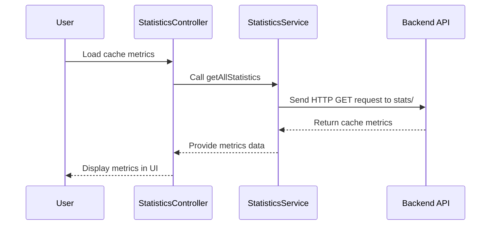

# Chapter 19: Application Statistics

In the [previous chapter](18_file_management_features_.md), we explored **File Management Features**, which simplify the process of selecting and reading files in the `xconfui` application. In this chapter, we will focus on **Application Statistics**, a feature designed to collect, analyze, and display key metrics about the application's performance and caching behavior.

---

## Motivation: Why is Application Statistics Important?

In systems with significant data processing and caching mechanisms, it is critical to monitor and optimize performance. **Application Statistics** provides insights into various operational metrics, such as cache hit rates, miss rates, and total load times, which allow administrators to:

1. Evaluate the efficiency of cache usage.
2. Identify potential bottlenecks in the system.
3. Optimize the application's caching and data retrieval strategies.

### Example Use Case

Consider a scenario where the application's performance has degraded, and users are experiencing slow response times. The administrator needs to:
- Analyze cache metrics to identify underperforming cache components.
- Reload specific caches or all caches to refresh the data and improve performance.
- Calculate summary statistics (e.g., average hit rate) to assess overall cache efficiency.

The **Application Statistics** feature provides the tools to achieve this by:
- Displaying real-time cache metrics for all column families.
- Allowing the administrator to reload individual caches or all caches.
- Calculating summary statistics such as average hit rate and total load time.

---

## Key Concepts

To effectively use **Application Statistics**, it is essential to understand its three main components:
1. **Cache Metrics**: Collect and display key statistics for each cache.
2. **Cache Reloading**: Refresh caches to ensure data consistency.
3. **Summary Statistics**: Calculate aggregate metrics to summarize overall cache performance.

Let’s explore each of these components in detail.

---

### 1. Cache Metrics

**Cache Metrics** provide detailed statistics about each cache, including:
- **Hit Rate**: The percentage of cache requests that were successful.
- **Miss Rate**: The percentage of cache requests that failed.
- **Total Load Time**: The cumulative time taken to load entries into the cache.

#### Example: Retrieving Cache Metrics

The cache metrics are loaded from the backend and displayed in a structured format. This is done by invoking the `getAllStatistics` method from the `statisticsService`.

```javascript
statisticsService.getAllStatistics().then(function (result) {
    vm.cacheMap = result.data;
});
```

**Explanation**:
- `getAllStatistics`: Sends an HTTP request to retrieve cache metrics for all column families.
- `result.data`: Contains the cache metrics, organized by column family names.

**Output**:
The `cacheMap` object may contain data like:
```json
{
    "columnFamilyA": {
        "totalLoadTime": 120,
        "hitRate": 95,
        "missRate": 5
    },
    "columnFamilyB": {
        "totalLoadTime": 80,
        "hitRate": 90,
        "missRate": 10
    }
}
```
This data is displayed in the user interface for administrators to analyze.

---

### 2. Cache Reloading

**Cache Reloading** allows administrators to refresh cache data, either for all caches or specific column families. This is useful for ensuring that outdated or inconsistent cache entries are updated.

#### Example: Reloading All Caches

The `reloadAllCache` method reloads all caches in the system.

```javascript
statisticsService.reloadAllCache().then(function (result) {
    vm.cacheMap = result.data;
});
```

**Explanation**:
- `reloadAllCache`: Sends an HTTP request to reload all caches.
- `result.data`: Returns the updated cache metrics after the reload.

#### Example: Reloading a Specific Cache

To reload a specific cache, use the `reloadCacheByCfName` method:

```javascript
statisticsService.reloadCacheByCfName('columnFamilyA').then(function (result) {
    vm.cacheMap['columnFamilyA'] = result.data;
});
```

**Explanation**:
- `reloadCacheByCfName`: Sends an HTTP request to reload the cache for a specific column family (e.g., `columnFamilyA`).
- `result.data`: Contains the updated metrics for the reloaded cache.

---

### 3. Summary Statistics

**Summary Statistics** provide aggregate metrics to give an overview of cache performance. These include:
- **General Time**: The total load time across all caches.
- **Average Hit Rate**: The average hit rate across all caches.
- **Average Miss Rate**: The average miss rate across all caches.

#### Example: Calculating Summary Statistics

The `countSummary` function calculates these aggregate metrics:

```javascript
function countSummary(cacheMap) {
    var sumTotalLoadTime = 0;
    var sumHitRate = 0;
    var sumMissRate = 0;
    var length = 0;

    for (var columnFamily in cacheMap) {
        length++;
        var obj = cacheMap[columnFamily];
        sumTotalLoadTime += parseInt(obj.totalLoadTime);
        sumHitRate += parseInt(obj.hitRate);
        sumMissRate += parseInt(obj.missRate);
    }

    vm.generalTime = sumTotalLoadTime;
    vm.avgHitRate = sumHitRate / length;
    vm.avgMissRate = sumMissRate / length;
}
```

**Explanation**:
- Iterates through the `cacheMap` object to calculate the sum of load times, hit rates, and miss rates.
- Computes the averages by dividing the total hit and miss rates by the number of caches.

**Output**:
The calculated metrics (e.g., `vm.generalTime`, `vm.avgHitRate`, `vm.avgMissRate`) are displayed to provide an overview of cache performance.

---

## Internal Implementation

Let’s explore what happens internally when the **Application Statistics** feature is used to retrieve and display cache metrics.

### Step-by-Step Walkthrough

Here’s a sequence diagram illustrating the process of retrieving cache metrics:



**Explanation**:
1. The user initiates the process to load cache metrics.
2. The `StatisticsController` calls the `getAllStatistics` method in the `statisticsService`.
3. The `statisticsService` sends an HTTP GET request to the backend API (`stats/`).
4. The backend returns the cache metrics data.
5. The service provides the data to the controller, which updates the user interface.

---

### Code Implementation

#### Statistics Controller
The controller is implemented in `statistics.controller.js`:

```javascript
function controller($log, statisticsService, alertsService) {
    var vm = this;
    vm.cacheMap = {};
    getCacheMap();

    function getCacheMap() {
        statisticsService.getAllStatistics().then(function (result) {
            vm.cacheMap = result.data;
        });
    }
}
```

**Explanation**:
- `getCacheMap`: Calls the `getAllStatistics` method to load cache metrics.
- `vm.cacheMap`: Stores the retrieved metrics for display in the UI.

---

#### Statistics Service
The service is implemented in `statistics.service.js`:

```javascript
function service($http) {
    var API_URL = 'stats/';

    return {
        getAllStatistics: getAllStatistics
    };

    function getAllStatistics() {
        return $http.get(API_URL);
    }
}
```

**Explanation**:
- `getAllStatistics`: Sends an HTTP GET request to the `stats/` endpoint to retrieve cache metrics.
- The returned data is passed to the controller for further processing.

---

## Conclusion

In this chapter, we explored the **Application Statistics** feature, which provides tools for analyzing and optimizing cache performance in the `xconfui` application. We covered:
- **Cache Metrics**: Retrieve and display statistics for each cache.
- **Cache Reloading**: Refresh caches to ensure data consistency.
- **Summary Statistics**: Calculate aggregate metrics to summarize cache performance.

These tools enable administrators to monitor and optimize the application's caching behavior effectively.

In the [next chapter](20_validation_services.md), we will delve into **Validation Services**, which ensure data integrity and correctness across the application.

---

Generated by [AI Codebase Knowledge Builder](https://github.com/The-Pocket/Tutorial-Codebase-Knowledge)