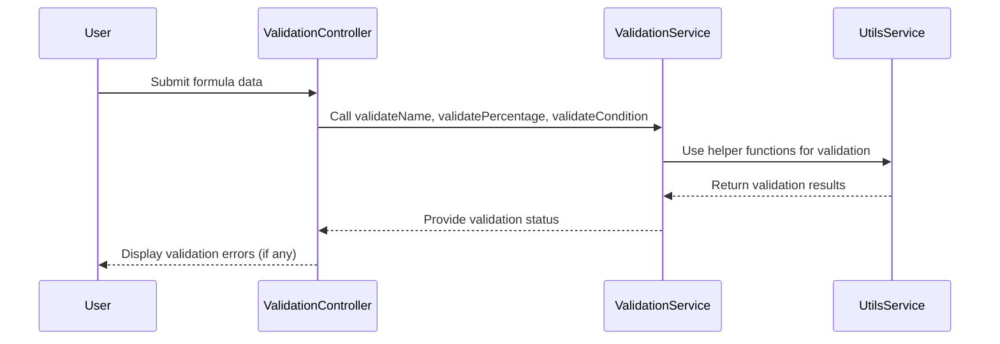

# Chapter 20: Validation Services

In the [previous chapter](19_application_statistics_.md), we explored **Application Statistics**, which provide tools for analyzing and optimizing cache performance in the `xconfui` application. In this chapter, we will focus on **Validation Services**, a feature that ensures data integrity and correctness across the application by validating rules, formulas, and other entities.

---

## Motivation: Why Are Validation Services Important?

In systems with dynamic configurations and extensive user input, ensuring data correctness is critical. Invalid or inconsistent data can lead to system failures, incorrect configurations, or suboptimal performance. **Validation Services** provide a centralized mechanism to verify that data meets expected criteria before it is processed or saved.

### Example Use Case

Consider a scenario where an administrator is creating a new formula to manage device configurations. Before saving the formula:
1. The name of the formula must be unique and non-empty.
2. Percentage values in the formula should be between 0 and 100.
3. Conditions in the formula must be properly defined.

The **Validation Services** feature provides reusable methods to validate these requirements, ensuring that only correct and complete data is accepted by the system. This prevents errors and simplifies debugging by catching issues early.

---

## Key Concepts

**Validation Services** are built around reusable validation functions that can be applied to various entities. These functions include:
1. **Name Validation**: Ensures names are non-empty and unique.
2. **Percentage Validation**: Checks that percentage values are within valid ranges.
3. **Condition Validation**: Verifies that conditions are properly defined.

---

### 1. Name Validation

**Name Validation** ensures that entity names are non-empty and do not conflict with existing names.

#### Example: Validating a Formula Name

The `validateName` function checks whether a name is valid by ensuring it is non-empty and unique.

```javascript
function validateName(name, usedNames) {
    if (utilsService.isNullOrUndefinedOrEmptyOrWhiteSpaceString(name)) {
        return { isValid: false, message: 'Name must not be empty' };
    }
    if (usedNames.indexOf(name) >= 0) {
        return { isValid: false, message: 'Such name already exists' };
    }
    return { isValid: true };
}
```

**Explanation**:
- If the name is empty or contains only whitespace, an error message is returned.
- If the name already exists in the provided `usedNames` array, an error message is returned.
- If both checks pass, the function returns `isValid: true`.

**Example Input**:
```javascript
validateName('Formula1', ['Formula2', 'Formula3']);
```

**Output**:
```json
{
    "isValid": true
}
```

---

### 2. Percentage Validation

**Percentage Validation** ensures that percentage values are numeric and between 0 and 100.

#### Example: Validating a Percentage Value

The `validatePercentage` function checks whether a percentage is valid.

```javascript
function validatePercentage(percentage) {
    if (!utilsService.isInt(percentage) || percentage < 0 || percentage > 100) {
        return { isValid: false, message: 'Percentage must be a number from 0 to 100' };
    }
    return { isValid: true };
}
```

**Explanation**:
- If the percentage is not an integer or is outside the range [0, 100], an error message is returned.
- If the percentage is valid, the function returns `isValid: true`.

**Example Input**:
```javascript
validatePercentage(50);
```

**Output**:
```json
{
    "isValid": true
}
```

---

### 3. Condition Validation

**Condition Validation** ensures that conditions are properly defined before saving rules or formulas.

#### Example: Validating a Condition

The `validateCondition` function checks whether a condition is non-empty and correctly structured.

```javascript
function validateCondition(rule) {
    if (utilsService.isNullOrUndefinedOrEmpty(rule.compoundParts) && !rule.condition) {
        return { isValid: false, message: 'Please fill condition' };
    }
    return { isValid: true };
}
```

**Explanation**:
- If the `compoundParts` attribute is empty and `condition` is not defined, an error message is returned.
- If the condition is valid, the function returns `isValid: true`.

**Example Input**:
```javascript
validateCondition({ condition: 'environment == "Production"' });
```

**Output**:
```json
{
    "isValid": true
}
```

---

## How Validation Services Work

Validation Services are applied to entities like formulas, rules, and filters to ensure data correctness before processing or saving. Here’s a sequence diagram to illustrate the process:



**Explanation**:
1. The user submits data (e.g., a formula) through the controller.
2. The controller calls validation functions from the service (e.g., `validateName`).
3. The service uses helper functions from `utilsService` to perform specific checks.
4. Validation results are returned to the controller.
5. If errors are detected, the controller displays them to the user.

---

## Internal Implementation

Let’s dive deeper into the code for Validation Services.

### Formula Validation Service

The `formulaValidationService` is implemented in `formula.validation.service.js`:

```javascript
function validateAll(rule, usedNames) {
    return validateName(rule.name, usedNames).isValid &&
           validatePercentage(rule.percentage).isValid &&
           validateCondition(rule).isValid;
}
```

**Explanation**:
- Combines multiple validation checks (e.g., name, percentage, condition) into a single method.
- Returns `true` only if all checks pass.

---

### Percent Filter Validation Service

The `percentFilterValidationService` is implemented in `percentfilter.validation.service.js`:

```javascript
function validatePercentFilter(filter) {
    return isValidPercentage(filter.percentage);
}
```

**Explanation**:
- Validates the percentage attribute of a filter using the `isValidPercentage` function.

---

### Feature Rule Validation Service

The `featureRuleValidationService` is implemented in `featurerule.validation.service.js`:

```javascript
function validateNumberOfFeatures(features, allowedNumberOfFeatures) {
    if (features.length === 0 || features.length > allowedNumberOfFeatures) {
        return false;
    }
    return true;
}
```

**Explanation**:
- Ensures that the number of features in a rule does not exceed the allowed limit.

---

## Conclusion

In this chapter, we explored **Validation Services**, which ensure data integrity and correctness across the `xconfui` application. We covered:
- **Name Validation**: Ensures names are non-empty and unique.
- **Percentage Validation**: Checks that percentage values are within valid ranges.
- **Condition Validation**: Verifies conditions are properly defined.

These services provide a robust framework for validating entities like formulas, rules, and filters, preventing errors and ensuring data consistency.

Next, we will explore [Change Management](21_change_management_.md), which focuses on tracking and managing changes to application configurations.

---

Generated by [AI Codebase Knowledge Builder](https://github.com/The-Pocket/Tutorial-Codebase-Knowledge)