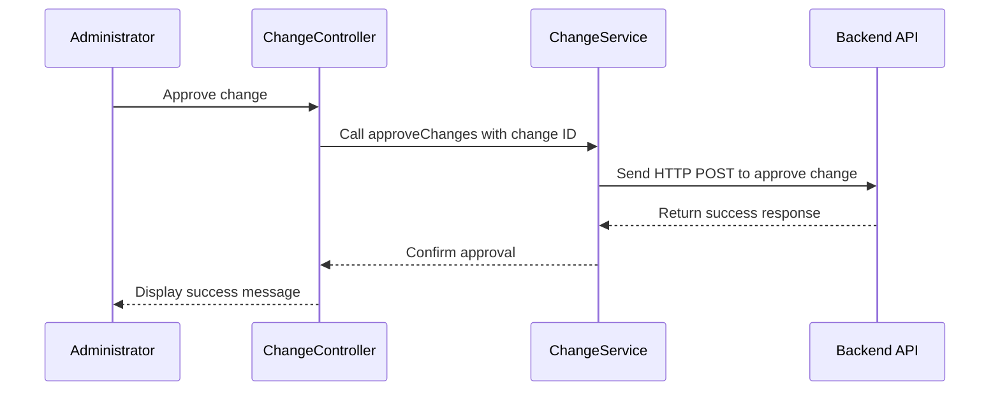

# Chapter 21: Change Management

In the [previous chapter](20_validation_services.md), we explored **Validation Services**, which ensure data integrity by validating rules, formulas, and other entities. Now, we will focus on **Change Management**, a feature that tracks and manages changes made to application configurations, providing tools for reviewing, approving, reverting, and organizing pending or approved changes.

---

## Motivation: Why Is Change Management Important?

In large-scale systems, configurations are often updated regularly to meet evolving requirements. Without proper tracking, these updates can lead to inconsistencies, unauthorized changes, or difficulty in troubleshooting issues. **Change Management** addresses these challenges by maintaining a clear audit trail of configuration updates while allowing administrators to:

1. Review changes before they are applied.
2. Approve or reject specific changes to ensure only verified configurations are deployed.
3. Revert changes that may introduce issues or are no longer needed.

### Example Use Case

Consider a scenario where:
- A team member proposes a configuration change to telemetry profiles.
- The change needs to be reviewed and approved by an administrator before being applied.
- After deployment, the change is found to cause issues, and the administrator must revert it.

**Change Management** enables this workflow by:
- Tracking all proposed changes (pending changes).
- Allowing administrators to approve, cancel, or revert changes.
- Organizing changes into clear categories (e.g., pending or approved).
- Providing pagination and filtering to manage changes efficiently.

---

## Key Concepts

To effectively use **Change Management**, it is essential to understand its three main components:
1. **Change Types**: Categorize changes as pending or approved.
2. **Change Operations**: Actions to approve, cancel, or revert changes.
3. **Pagination and Filtering**: Manage large numbers of changes efficiently.

Let’s explore each of these components in detail.

---

### 1. Change Types

**Change Types** categorize changes into two main groups:
- **Pending Changes**: Changes that are proposed but not yet approved. These changes require review.
- **Approved Changes**: Changes that have been reviewed and approved. These are applied to the system.

#### Example: Retrieving Pending Changes

To retrieve pending changes, use the `getFilteredChanges` method provided by the `changeService`.

```javascript
changeService.getFilteredChanges(vm.pageSize, vm.pageNumber, vm.searchParam).then(function (response) {
    vm.changes = response.data;
});
```

**Explanation**:
- `vm.pageSize`: The number of changes to display per page.
- `vm.pageNumber`: The current page number.
- `vm.searchParam`: Optional search parameters for filtering changes.
- `response.data`: Contains the retrieved pending changes.

---

### 2. Change Operations

**Change Operations** allow administrators to manage changes by performing actions such as:
- **Approve**: Accept and apply a pending change.
- **Cancel**: Reject a pending change.
- **Revert**: Undo an approved change.

#### Example: Approving Selected Changes

To approve multiple changes, use the `approveChanges` method:

```javascript
var changeIds = ['change1', 'change2'];
changeService.approveChanges(changeIds).then(function () {
    alertsService.showSuccessMessage({ message: 'Selected changes approved.' });
});
```

**Explanation**:
- `changeIds`: An array of IDs representing the changes to approve.
- `approveChanges`: Sends a request to approve the specified changes.
- On success, a success message is displayed.

#### Example: Reverting Changes

To revert approved changes, use the `revertChanges` method:

```javascript
changeService.revertChanges(['change1']).then(function () {
    alertsService.showSuccessMessage({ message: 'Change reverted successfully.' });
});
```

**Explanation**:
- `revertChanges`: Sends a request to undo the specified changes.
- On success, a success message is displayed.

---

### 3. Pagination and Filtering

Managing a large number of changes is simplified through pagination and filtering. These tools allow administrators to:
- Navigate between pages of changes.
- Search for changes by entity type, author, or other criteria.

#### Example: Implementing Pagination

Pagination is managed using the `paginationService`:

```javascript
vm.pageSize = paginationService.getPageSize(vm.paginationStorageKey, "10");
vm.pageNumber = paginationService.getPageNumber();

function getChanges() {
    changeService.getFilteredChanges(vm.pageSize, vm.pageNumber, vm.searchParam).then(function (response) {
        vm.changes = response.data;
    });
}
```

**Explanation**:
- `paginationService.getPageSize`: Retrieves the default or user-specified page size.
- `paginationService.getPageNumber`: Retrieves the current page number.
- `getFilteredChanges`: Fetches changes for the specified page size and number.

---

## Internal Implementation

Let’s explore what happens internally when administrators retrieve and manage changes.

### Step-by-Step Walkthrough

Here’s a sequence diagram illustrating the workflow for approving a change:



**Explanation**:
1. The administrator initiates the approval process from the user interface.
2. The `ChangeController` calls the `approveChanges` method in the `changeService`.
3. The `changeService` sends a request to the backend to approve the change.
4. The backend processes the request and returns a response.
5. The `changeService` notifies the controller of the successful approval.
6. The controller displays a success message to the administrator.

---

### Code Implementation

#### Change Controller
The `ChangeController` is implemented in `change.controller.js`:

```javascript
function getChanges() {
    changeService.getFilteredChanges(vm.pageSize, vm.pageNumber, vm.searchParam).then(function (response) {
        vm.changes = response.data;
    });
}

function applySelectedChanges() {
    var changeIds = vm.changesForMultipleOperation.map(change => change.id);
    changeService.approveChanges(changeIds).then(function () {
        alertsService.showSuccessMessage({ message: 'Selected changes approved.' });
        getChanges();
    });
}
```

**Explanation**:
- `getChanges`: Retrieves the list of changes using `changeService`.
- `applySelectedChanges`: Approves selected changes and updates the list of changes.

---

#### Change Service
The `ChangeService` is implemented in `change.service.js`:

```javascript
function approveChanges(changeIds) {
    return $http.post('telemetry/change/approveChanges', changeIds);
}

function getFilteredChanges(pageSize, pageNumber, searchParam) {
    return $http.post(`telemetry/change/changes/filtered?pageSize=${pageSize}&pageNumber=${pageNumber}`, searchParam);
}
```

**Explanation**:
- `approveChanges`: Sends a POST request to approve the specified changes.
- `getFilteredChanges`: Sends a POST request to retrieve filtered changes based on pagination and search parameters.

---

## Conclusion

In this chapter, we explored **Change Management**, which provides tools for tracking and managing changes to application configurations. We covered:
- **Change Types**: Categorize changes as pending or approved.
- **Change Operations**: Approve, cancel, or revert changes.
- **Pagination and Filtering**: Manage large numbers of changes efficiently.

These tools ensure that configuration updates are tracked, reviewed, and applied in a controlled and organized manner.

---

Generated by [AI Codebase Knowledge Builder](https://github.com/The-Pocket/Tutorial-Codebase-Knowledge)