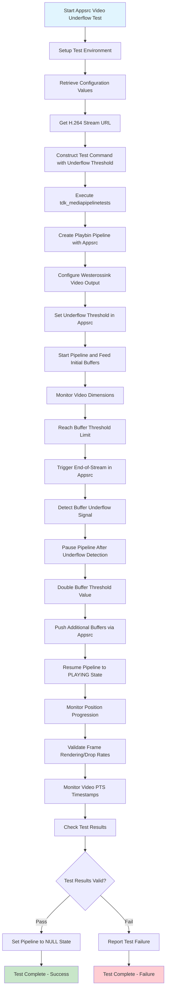

# FNCS_Playback_Appsrc_Video_Underflow_Playback_H264 Test Case Documentation

## TestCase ID
FNCS_PLAYBACK_244

## TestCase Name
FNCS_Playback_Appsrc_Video_Underflow_Playback_H264

## Table Of Contents
  - [TestCase ID](#testcase-id)
  - [TestCase Name](#testcase-name)
  - [Table Of Contents](#table-of-contents)
  - [Objective](#objective)
  - [Configuration](#configuration)
  - [GStreamer Elements and Properties](#gstreamer-elements-and-properties)
    - [playbin](#playbin)
    - [appsrc](#appsrc)
    - [westerossink](#westerossink)
  - [Test Flow Diagram](#test-flow-diagram)
  - [Preconditions](#preconditions)
  - [Test Steps](#test-steps)
  - [Command Executed](#command-executed)
  - [Test Attributes](#test-attributes)

## Objective
To verify playback recovery after pushing additional video buffers from "appsrc" once underflow state is reached through 'playbin' and 'westerossink' GStreamer elements. This test validates the media pipeline's capability to handle buffer underflow situations by detecting underflow signals, managing pipeline state transitions, and successfully resuming playback with additional buffer data using appsrc for controlled buffer feeding with comprehensive playback validation mechanisms including position monitoring, frame rendering validation, and PTS timestamp checking.

**VIDEO CODEC:** H.264

The test supports flexible stream source configuration through TEST_STREAMS_BASE_PATH - users can configure streams via filesrc (copying stream to USB like file:/tmp/usb/) or httpsrc via HTTPS server (https://<server_hosting_stream>:<port_number>/) based on their setup preference.

## Configuration

| Variable Name | Default Value | Source | Description |
|---------------|---------------|--------|-------------|
| FIREBOLT_COMPLIANCE_CHECK_AV_STATUS | no | Video_Accelerator.config | Enables/disables SOC-level audio/video playback verification check |
| FIREBOLT_COMPLIANCE_CHECK_PTS | yes | Video_Accelerator.config | Enables/disables video PTS timestamp validation during playback |
| FIREBOLT_COMPLIANCE_CHECK_FPS | yes | Video_Accelerator.config | Enables/disables video frame rate validation during playback |
| FIREBOLT_COMPLIANCE_USE_AUDIO_SINK | (empty) | Video_Accelerator.config | Specifies custom audio sink element, empty means use default |
| FIREBOLT_COMPLIANCE_VALIDATE_FULL_PLAYBACK | yes | Video_Accelerator.config | Enables millisecond-level playback position validation |
| FIREBOLT_COMPLIANCE_USE_APPSRC | yes | Video_Accelerator.config | Enables/disables appsrc usage in pipeline instead of direct URI |
| FIREBOLT_COMPLIANCE_START_WESTEROS | no | Video_Accelerator.config | Enables/disables automatic westeros compositor startup |
| video_src_url_mp4_30fps | TDK_Asset_Sunrise_30fps_v2.mp4 | MediaValidationVariables.py | H.264 video stream URL for appsrc underflow testing with 30fps playback |

## GStreamer Elements and Properties

### playbin
- **uri property**: Set to the H.264 stream URL from MediaValidationVariables (TDK_Asset_Sunrise_30fps_v2.mp4)
- **flags property**: Updated to enable video playback capabilities (audio disabled for video-only test)
- **video-sink property**: Linked to westerossink element for video output
- **video-height property**: Retrieved to validate video dimensions
- **video-width property**: Retrieved to validate video dimensions
- **element-setup signal**: Connected for element configuration callback
- **async-handling property**: Set to true to enable asynchronous state changes

### appsrc
- **size property**: Set with underflow threshold value (2796910 bytes) for controlled buffer feeding
- **push-buffer signal**: Used to manually feed video data buffers to pipeline in controlled amounts
- **end-of-stream signal**: Emitted when initial buffer threshold is reached to trigger underflow
- **caps property**: Set to appropriate H.264 video caps for proper decoding
- **stream-type property**: Set to seekable stream type for proper buffer management
- **format property**: Set to bytes format for raw buffer pushing

### westerossink
- **buffer-underflow-callback signal**: Connected to detect video buffer underflow conditions and capture underflow events
- **video-pts property**: Used for presentation timestamp validation during PlaybackValidation
- **stats property**: Used for frame rendering and drop validation during PlaybackValidation
- **first-video-frame-callback signal**: Connected to monitor first frame rendering after underflow recovery

## Test Flow Diagram



## Preconditions

| ID | Conditions |
|----|------------|
| 1 | tdk_mediapipelinetests application must be installed in DUT |
| 2 | TDK_Asset_Sunrise_30fps_v2.mp4 must be installed in the server hosting streams or installed inside the device if user is selecting filesrc instead of httpsrc |
| 3 | FIREBOLT_COMPLIANCE_CHECK_AV_STATUS can be set to yes/no, currently set to no |
| 4 | FIREBOLT_COMPLIANCE_VALIDATE_FULL_PLAYBACK configuration should be set to yes/no for advanced playback validation, currently set to yes |
| 5 | FIREBOLT_COMPLIANCE_CHECK_PTS configuration should be set to yes/no for video PTS validation, currently set to yes |
| 6 | FIREBOLT_COMPLIANCE_CHECK_FPS configuration should be set to yes/no for frame rate validation, currently set to yes |

## Test Setup

For detailed test setup instructions, please refer to: [Firebolt Native Apps Compliance Suite Test Setup](https://wiki.rdkcentral.com/spaces/TDK/pages/149894400/Firebolt+Native+Apps+Compliance+Suite+Test+Setup)

## Test Steps

| ID | StepName | Step Description | Expected Result |
|----|----------|------------------|----------------|
| 1 | Initialize Test Environment | Setup environment for playback using platform specific environment variables from TDK.env and create display for playback environment using RDKShell plugin or using westeros --renderer command | All environment variables must be set successfully and display for playback must be created successfully |
| 2 | Execute Media Pipeline Test | Retrieve FIREBOLT_COMPLIANCE_CHECK_AV_STATUS config value, get H.264 stream URL from MediaValidationVariables.video_src_url_mp4_30fps, construct tdk_mediapipelinetests command with underflow threshold parameter (2796910 bytes), and run test_appsrc_video_underflow with H.264 stream | Configuration values retrieved, H.264 stream URL obtained, command constructed with proper underflow threshold, and test application starts execution without errors |
| 3 | Create GStreamer Pipeline with Appsrc | Initialize playbin element and configure with force_appsrc flag for video-only playback, set bufferUnderflowTest flag to enable underflow detection | Playbin element created successfully with appsrc integration and underflow testing capability enabled |
| 4 | Configure Video Output | Create westerossink element and link it to playbin as video-sink with buffer underflow signal connection | Westerossink element created and linked successfully to playbin with underflow callback configured |
| 5 | Setup Appsrc Element | Configure appsrc with size property set to underflow threshold (2796910 bytes), set appropriate H.264 caps, and connect push-buffer signal for manual feeding | Appsrc element configured successfully with threshold size and H.264 video capabilities |
| 6 | Start Pipeline and Feed Buffers | Set pipeline to PLAYING state and begin feeding video data through appsrc up to threshold limit | Pipeline transitions to PLAYING state successfully and starts consuming buffers from appsrc |
| 7 | Validate Video Dimensions | Retrieve and verify video height and width properties from westerossink | Video dimensions obtained successfully indicating proper H.264 decoding |
| 8 | Reach Buffer Threshold | Continue feeding buffers via appsrc until threshold bytes (2796910) are reached | Threshold limit reached successfully, pipeline consuming all provided buffer data |
| 9 | Trigger Buffer Underflow | Emit end-of-stream signal from appsrc to stop buffer feeding and trigger underflow condition | End-of-stream signal emitted successfully, causing pipeline to enter underflow state |
| 10 | Detect Underflow Signal | Monitor westerossink buffer-underflow-callback signal to capture underflow event detection | Buffer underflow signal received successfully indicating proper underflow detection mechanism |
| 11 | Pause Pipeline | Set pipeline to PAUSED state after underflow signal detection to prepare for buffer refilling | Pipeline transitions to PAUSED state successfully, stopping playback temporarily |
| 12 | Update Buffer Threshold | Double the buffer threshold value to 5593820 bytes and prepare for additional buffer feeding | Buffer threshold updated successfully, ready for extended buffer feeding |
| 13 | Push Additional Buffers | Feed additional video buffers through appsrc with updated threshold to resume playback | Additional buffers pushed successfully via appsrc element with increased threshold |
| 14 | Resume Pipeline Playback | Set pipeline back to PLAYING state to resume video playback from current position | Pipeline transitions to PLAYING state successfully and resumes video playback |
| 15 | Monitor Position Progression | Execute position monitoring validation checking playback position advancement each second | Playback progresses smoothly with position advancing at normal rate after underflow recovery |
| 16 | Validate Frame Rendering | Use westerossink stats property to monitor rendered and dropped frame counts each second | Frame drop rate remains below 1% threshold during playback indicating proper video rendering recovery |
| 17 | Monitor Video PTS Timestamps | Use westerossink video-pts property to obtain presentation timestamps each millisecond for smooth timing validation | Video PTS timestamps progress smoothly indicating proper H.264 decoding timing after underflow recovery |
| 18 | Validate Test Output | Parse tdk_mediapipelinetests output for success indicators "Failures: 0", "Errors: 0", or "failed: 0" | Test output contains success strings indicating H.264 appsrc underflow recovery completed without errors |
| 19 | Cleanup Pipeline | Set playbin pipeline to NULL state and release resources | Pipeline transitions to NULL state successfully and resources cleaned up |

## Command Executed

```bash
tdk_mediapipelinetests test_appsrc_video_underflow https://<server_hosting_stream>:<port_number>/TDK_Asset_Sunrise_30fps_v2.mp4 checkavstatus=no validateFullPlayback underflow_threshold=2796910
```

## Test Attributes

**Supported Models:** Video_Accelerator, RPI-CLIENT, RPI-HYB

**Estimated Duration:** 7 minutes  

**Priority:** High


**Release Version:** M122
