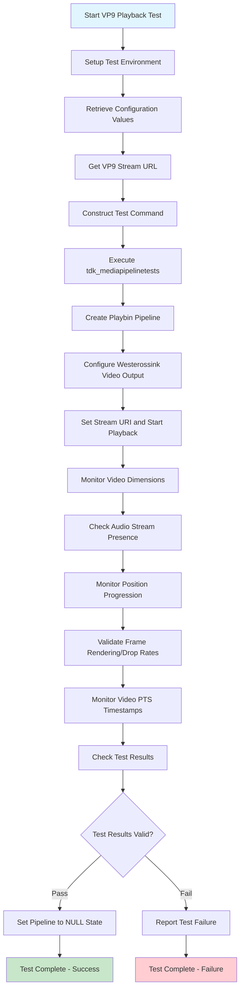

# FNCS_Playback_VP9 Test Case Documentation

## TestCase ID
FNCS_PLAYBACK_07

## TestCase Name
FNCS_Playback_VP9

## Table Of Contents
  - [TestCase ID](#testcase-id)
  - [TestCase Name](#testcase-name)
  - [Table Of Contents](#table-of-contents)
  - [Objective](#objective)
  - [Configuration](#configuration)
  - [GStreamer Elements and Properties](#gstreamer-elements-and-properties)
    - [playbin](#playbin)
    - [westerossink](#westerossink)
  - [Test Flow Diagram](#test-flow-diagram)
  - [Preconditions](#preconditions)
  - [Test Steps](#test-steps)
  - [Command Executed](#command-executed)
  - [Test Attributes](#test-attributes)

## Objective
To test the video playback of VP9 stream through 'playbin' and 'westerossink' GStreamer elements. This test validates the media pipeline's capability to decode and render VP9 video content using the playbin high-level element for media handling and westerossink for video output and signal capture with comprehensive playback validation mechanisms including position monitoring, frame rendering validation, and PTS timestamp checking.

**VIDEO CODEC:** VP9

**AUDIO CODEC:** OPUS

The test supports flexible stream source configuration through TEST_STREAMS_BASE_PATH - users can configure streams via filesrc (copying stream to USB like file:/tmp/usb/) or httpsrc via HTTPS server (https://<server_hosting_stream>:<port_number>/) based on their setup preference.

## Configuration

| Variable Name | Default Value | Source | Description |
|---------------|---------------|--------|-------------|
| FIREBOLT_COMPLIANCE_CHECK_AV_STATUS | no | Video_Accelerator.config | Enables/disables SOC-level audio/video playback verification check |
| FIREBOLT_COMPLIANCE_MEDIAPLAYBACK_TIMEOUT | 10 | Video_Accelerator.config | Timeout in seconds for video playback duration before checking AV status |
| FIREBOLT_COMPLIANCE_CHECK_PTS | yes | Video_Accelerator.config | Enables/disables video PTS timestamp validation during playback |
| FIREBOLT_COMPLIANCE_CHECK_FPS | yes | Video_Accelerator.config | Enables/disables video frame rate validation during playback |
| FIREBOLT_COMPLIANCE_USE_AUDIO_SINK | (empty) | Video_Accelerator.config | Specifies custom audio sink element, empty means use default |
| FIREBOLT_COMPLIANCE_VALIDATE_FULL_PLAYBACK | yes | Video_Accelerator.config | Enables millisecond-level playback position validation |
| FIREBOLT_COMPLIANCE_USE_APPSRC | no | Video_Accelerator.config | Enables/disables appsrc usage in pipeline instead of direct URI |
| FIREBOLT_COMPLIANCE_START_WESTEROS | no | Video_Accelerator.config | Enables/disables automatic westeros compositor startup |
| video_src_url_vp9 | DASH_VP9_OPUS_WebM/master.mpd | MediaValidationVariables.py | VP9 video stream URL with OPUS audio codec for playback testing |

## GStreamer Elements and Properties

### playbin
- **uri property**: Set to the VP9 stream URL from MediaValidationVariables (DASH_VP9_OPUS_WebM/master.mpd)
- **flags property**: Updated to enable video and audio playback capabilities
- **video-sink property**: Linked to westerossink element for video output
- **video-height property**: Retrieved to validate video dimensions
- **video-width property**: Retrieved to validate video dimensions  
- **n-audio property**: Retrieved to check audio stream availability
- **element-setup signal**: Connected for element configuration callback
- **async-handling property**: Set to true to enable asynchronous state changes

### westerossink
- **first-video-frame-callback signal**: Connected to monitor first frame rendering
- **buffer-underflow-callback signal**: Connected to detect video buffer underflow conditions
- **video-pts property**: Used for presentation timestamp validation during PlaybackValidation
- **stats property**: Used for frame rendering and drop validation during PlaybackValidation

## Test Flow Diagram



## Preconditions

| ID | Conditions |
|----|------------|
| 1 | tdk_mediapipelinetests application must be installed in DUT |
| 2 | DASH_VP9_OPUS_WebM/master.mpd must be installed in the server hosting streams or installed inside the device if user is selecting filesrc instead of httpsrc |
| 3 | FIREBOLT_COMPLIANCE_CHECK_AV_STATUS can be set to yes/no, currently set to no |
| 4 | FIREBOLT_COMPLIANCE_MEDIAPLAYBACK_TIMEOUT configuration should be set to time to wait before checking for AV playback, currently set to 10 seconds |
| 5 | FIREBOLT_COMPLIANCE_CHECK_PTS configuration should be set to yes/no for video PTS validation, currently set to yes |
| 6 | FIREBOLT_COMPLIANCE_CHECK_FPS configuration should be set to yes/no for frame rate validation, currently set to yes |
| 7 | FIREBOLT_COMPLIANCE_VALIDATE_FULL_PLAYBACK configuration should be set to yes/no for millisecond-level validation, currently set to yes |

## Test Steps

| ID | StepName | Step Description | Expected Result |
|----|----------|------------------|----------------|
| 1 | Initialize Test Environment | Setup environment for playback using platform specific environment variables from TDK.env and create display for playback environment using RDKShell plugin or using westeros --renderer command | All environment variables must be set successfully and display for playback must be created successfully |
| 2 | Execute Media Pipeline Test | Retrieve FIREBOLT_COMPLIANCE_CHECK_AV_STATUS and FIREBOLT_COMPLIANCE_MEDIAPLAYBACK_TIMEOUT config values, get VP9 stream URL from MediaValidationVariables.video_src_url_vp9, construct tdk_mediapipelinetests command with parameters, and run test_generic_playback with VP9 stream | Configuration values retrieved, VP9 DASH stream URL obtained, command constructed properly, and test application starts execution without errors |
| 3 | Create GStreamer Pipeline | Initialize playbin element and configure video/audio flags for VP9 playback | Playbin element created successfully with proper flag configuration |
| 4 | Configure Video Output | Create westerossink element and link it to playbin as video-sink | Westerossink element created and linked successfully to playbin |
| 5 | Setup Stream URI | Set VP9 stream URI in playbin and configure async handling | Stream URI set successfully and pipeline ready for playback |
| 6 | Connect Signal Callbacks | Connect first-video-frame-callback and buffer-underflow-callback to westerossink | Signal callbacks connected successfully for frame and underflow monitoring |
| 7 | Start Video Playback | Set pipeline to PLAYING state and begin VP9 stream playback | Pipeline transitions to PLAYING state successfully |
| 8 | Validate Video Dimensions | Retrieve and verify video height and width properties from westerossink | Video dimensions obtained successfully indicating proper VP9 decoding |
| 9 | Check Audio Stream Availability | Get n-audio property from playbin to determine audio stream presence | Audio stream presence detected and validated for VP9 content |
| 10 | Monitor Position Progression | Execute position monitoring validation checking playback position advancement each second | Playback progresses smoothly with position advancing at normal rate for smooth playback |
| 11 | Validate Frame Rendering | Use westerossink stats property to monitor rendered and dropped frame counts each second | Frame drop rate remains below 1% threshold during playback indicating proper video rendering |
| 12 | Monitor Video PTS Timestamps | Use westerossink video-pts property to obtain presentation timestamps each millisecond for smooth timing validation | Video PTS timestamps progress smoothly indicating proper VP9 decoding timing |
| 13 | Validate Test Output | Parse tdk_mediapipelinetests output for success indicators "Failures: 0", "Errors: 0", or "failed: 0" | Test output contains success strings indicating VP9 playback completed without errors |
| 14 | Cleanup Pipeline | Set playbin pipeline to NULL state and release resources | Pipeline transitions to NULL state successfully and resources cleaned up |

## Command Executed

```bash
tdk_mediapipelinetests test_generic_playback https://<server_hosting_stream>:<port_number>/DASH_VP9_OPUS_WebM/master.mpd checkavstatus=no timeout=10 validateFullPlayback
```

## Test Attributes

**Supported Models:** Video_Accelerator

**Estimated Duration:** 3 minutes  

**Priority:** High


**Release Version:** M121
