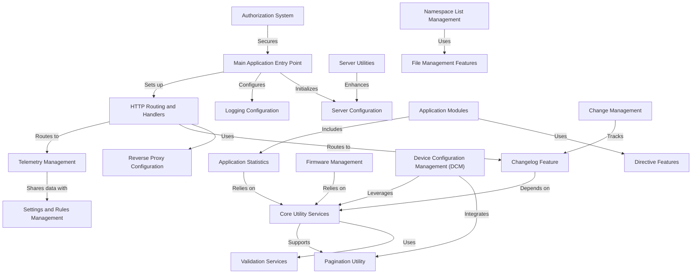

# Tutorial: xconfui

The `xconfui` project is a web-based **configuration management system** designed to handle diverse configuration needs across multiple domains such as firmware, device settings, telemetry, and authorization. 
It provides a **user-friendly interface** built with AngularJS and a **robust backend** implemented in Go for handling server-side operations. 
The application includes features like **changelog tracking**, **validation services**, **telemetry management**, **settings and rules management**, and **pagination utilities**. 
It also integrates a **reverse proxy** to forward API requests to backend services, ensuring separation of concerns and modularity. 
Key functionalities encompass **logging**, **server configuration**, **statistical reporting**, and **file management** to support **scalability** and *maintainability*.

**Source Repository:** [https://github.com/rdkcentral/xconfui](https://github.com/rdkcentral/xconfui)

## Chapters

1. [Main Application Entry Point
](01_main_application_entry_point_.md)
2. [Server Configuration
](02_server_configuration_.md)
3. [Logging Configuration
](03_logging_configuration_.md)
4. [HTTP Routing and Handlers
](04_http_routing_and_handlers_.md)
5. [Reverse Proxy Configuration
](05_reverse_proxy_configuration_.md)
6. [Changelog Feature
](06_changelog_feature_.md)
7. [Core Utility Services
](07_core_utility_services_.md)
8. [Directive Features
](08_directive_features_.md)
9. [Firmware Management
](09_firmware_management_.md)
10. [Device Configuration Management (DCM)
](10_device_configuration_management__dcm__.md)
11. [Namespace List Management
](11_namespace_list_management_.md)
12. [Telemetry Management
](12_telemetry_management_.md)
13. [Settings and Rules Management
](13_settings_and_rules_management_.md)
14. [Authorization System
](14_authorization_system_.md)
15. [Server Utilities
](15_server_utilities_.md)
16. [Application Modules
](16_application_modules_.md)
17. [Pagination Utility
](17_pagination_utility_.md)
18. [File Management Features
](18_file_management_features_.md)
19. [Application Statistics
](19_application_statistics_.md)
20. [Validation Services
](20_validation_services_.md)
21. [Change Management
](21_change_management_.md)

---

Generated by [AI Codebase Knowledge Builder](https://github.com/The-Pocket/Tutorial-Codebase-Knowledge)